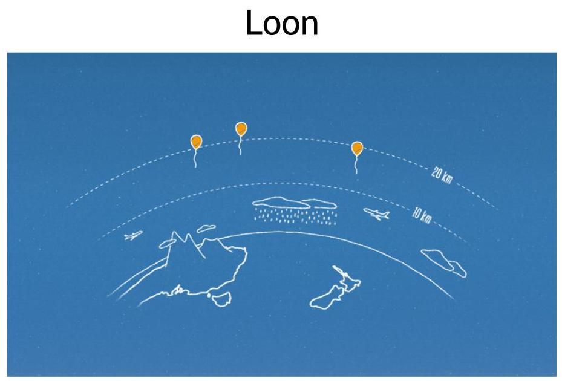
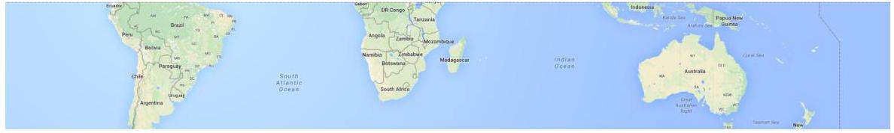
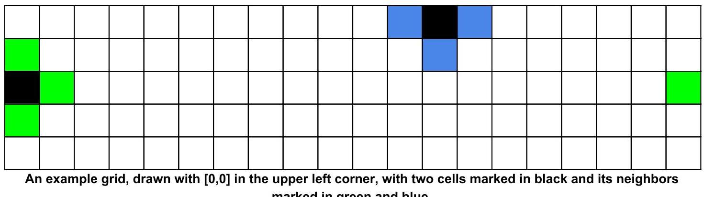
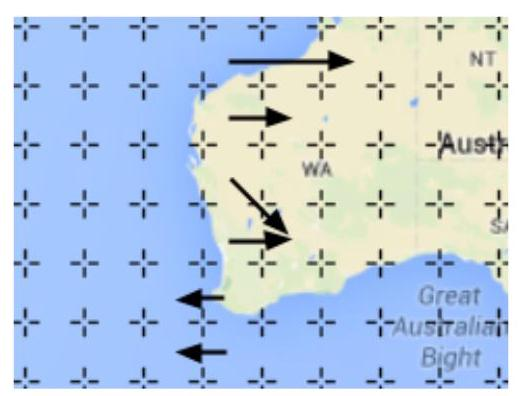
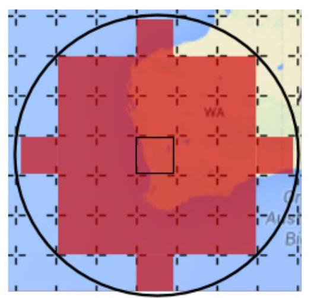

## Hash Code  by Google France

Problem statement for the Main Round, March 28th, 2015

Introduction

Task

Problem description

Earth grid

Wind

Launching balloons and altitude adjustments

Internet coverage

Goal

Input data

Example

Submissions

File format

Example

Validation

Scoring

Notes

Possible twists

## Introduction

Sometimes "everyone" isn't really everyone. Like when people say that everyone is on the Internet - because for each person that can get online, there are two that can't.

Project Loon aims to bring universal Internet access using a fleet of high-altitude balloons equipped with LTE transmitters. Circulating around the world, Loon balloons deliver Internet access in areas that lack conventional means of Internet connectivity.

One thing that the Loon balloons can't do though is moving on their own - each balloon can adjust its altitude, but needs to rely on high-altitude winds to carry them around. This requires careful coordination of the balloons - each has to adjust its altitude to hit the right wind streams and reach populated areas targeted by the program.

## Task

Given the wind data at different altitudes, plan altitude adjustments for a fleet of balloons to provide Internet coverage to select locations.

## Problem description

## Earth grid

The balloons fly over a section of the Earth delimited by two parallels.

Example section of the Earth surface delimited by two parallels.

This section is modeled as a rectangular,2-dimensional grid of dimensions $\mathbf{R}$ by $\mathbf{C}$ . The cells within the grid are referenced using a pair of 0-based coordinates $\left\lbrack  {r, c}\right\rbrack$ , denoting respectively the row and the column of the cell.

As the Earth is round, the grid is cyclic at the edges of each row. That is, any cell $\left\lbrack  {r,0}\right\rbrack$ is neighboring with both cells $\left\lbrack  {r, C - 1}\right\rbrack$ and $\left\lbrack  {r,1}\right\rbrack$ . The grid is not circular at the edges of columns.

marked in green and blue.

## Wind

For the sake of the simulation, we assume the wind to be stable - not changing over time.

The movement of the balloons caused by the wind is represented using grids of integer vectors, called movement grids. Movement grids correspond to the grid of the Earth surface: a vector(a, b)in the cell $\left\lbrack  {r, c}\right\rbrack$ of a movement grid means that a balloon positioned over $\left\lbrack  {r, c}\right\rbrack$ :

- will be moved to the cell $\left\lbrack  {r + a,\left( {c + b}\right) {\;\operatorname{mod}\;C}}\right\rbrack$ , if $0 \leq  r + a < R$ , that is, if the target cell remains within the range of rows of the simulation

- will be irreversibly lost and removed from the simulation, if $r + a < 0$ or $r + a \geq  R$ .

There are $\mathbf{A}$ movement grids, one for each altitude considered in the model. We assume that the wind never changes the altitude of a balloon.

One column of a movement grid visualized using arrows.

## Launching balloons and altitude adjustments

At the beginning of the simulation, all balloons are positioned in the single starting cell - ready to be launched, but not actually in the air.

The simulation proceeds in turns. At the beginning of each turn:

- the balloons that have already been launched can change their altitude by 1, 0 or -1, provided that the target altitude remains between 1 and $\mathbf{A}$ . A balloon that has been already launched cannot be brought back to the ground and re-launched later.

- the balloons that have not yet been launched can launch (changing the altitude by +1) or stay on the ground (changing the altitude by 0)

After the altitude adjustment, any launched balloon (including the ones launched in the same turn, but not those that were already lost and removed from the simulation) moves to the cell indicated by the corresponding vector in the movement grid at the new altitude of the balloon.

Multiple balloons can simultaneously occupy the same cell at the same altitude. In particular, it is allowed to launch multiple balloons in the same turn.

## Internet coverage

Each balloon (once it is launched, and until it is lost and removed from the simulation) provides Internet coverage for cells within a circular region of the radius $\mathbf{V}$ centered at the balloon. For a balloon positioned over the cell $\left\lbrack  {r, c}\right\rbrack$ , the cell $\left\lbrack  {u, v}\right\rbrack$ receives Internet coverage from it if, and only if, ${\left( r - u\right) }^{2} + {\left( \text{ columndist }\left( c, v\right) \right) }^{2} \leq  {V}^{2}$ .

columndist $\left( {{c}_{1},{c}_{2}}\right)  = \min \left( {\left| {{c}_{1} - {c}_{2}}\right| , C - \left| {{c}_{1} - {c}_{2}}\right| }\right)$ takes into account the fact that the grid is circular at the edges of the rows - it is the smaller of two distances between the given columns.

Range of the cells covered by a balloon (position at the center) when V equals 3 .

Note that the coverage does not depend on the altitude. We assume that the coverage differences between altitudes are negligible.

## Goal

A set of target cells specifies the populated areas that we want to provide with Internet access. For each turn, any target cell within the coverage of at least one balloon at the end of that turn will contribute 1 point to the final score. Covering the same target cell with more than one balloon doesn't increase the score for that cell above 1 point. One balloon can cover multiple target cells in the same turn.

The goal is to achieve as high a score as possible.

## Input data

The input data is provided in a plain text file containing exclusively ASCII characters with lines terminated with a single '\\n' character at the end of each line (UNIX-style line endings).

## The file consists of:

- one line containing the following natural numbers separated by single spaces:

- $\mathbf{R}\left( {1 \leq  R \leq  {1000}}\right)$ denotes the number of rows in the grid,

- $C\left( {1 \leq  C \leq  {1000}}\right)$ denotes the number of columns in the grid,

- $\mathbf{A}\left( {1 \leq  A \leq  {1000}}\right)$ denotes the number of different altitudes considered in the model

- one line containing the following natural numbers separated by single spaces:

- $L\left( {1 \leq  L \leq  {1000}}\right)$ denotes the number of target cells,

- $V\left( {0 \leq  V \leq  {100}}\right)$ denotes the coverage radius,

- $\mathbf{B}\left( {1 \leq  B \leq  {1000}}\right)$ denotes the number of available balloons,

- $T\left( {1 \leq  T \leq  {1000}}\right)$ denotes the number of turns in the simulation;

- one line containing a pair of natural numbers separated by a single space: ${r}_{\mathrm{s}}$ and ${c}_{\mathrm{s}}$ $\left( {0 \leq  {r}_{s} < R,0 \leq  {c}_{s} < C}\right)$ describing the starting cell of the balloons as $\left\lbrack  {{r}_{s},{c}_{s}}\right\rbrack$

- L lines describing the target cells, each of which contains:

- a pair of natural numbers separated by a single space: ${r}_{i}$ and ${c}_{i}\left( {0 \leq  {r}_{i} < R,0 \leq  {c}_{i} < C}\right)$ describing i-th target cell as $\left\lbrack  {{r}_{i},{c}_{i}}\right\rbrack$ . Each target cell will be unique, but the starting cell can be a target cell.

- A sections describing the movement grids at subsequent altitudes from 1 to $\mathbf{A}$ . Each section consists of:

- $R$ lines describing subsequent rows of wind vectors. Each of the rows contains:

$\mathbf{C}$ pairs of natural numbers: $\Delta {\mathbf{r}}_{rc}$ and $\Delta {\mathbf{c}}_{rc}\left( {-{100} \leq  \Delta {r}_{rc} \leq  {100}, - {100} \leq  \Delta {c}_{rc} \leq  {100}}\right)$ separated by single spaces (both within a pair as well as between the pairs). Each subsequent pair describes the wind vector at $\left\lbrack  {r, c}\right\rbrack$ as $\left( {\Delta {r}_{rc},\Delta {c}_{rc}}\right)$ .

Example

An example input file could look as follows.

---

	<table><tr><td>3 1 2 2 4 0101010101 0101010101 $\left\lbrack  \begin{matrix}  - 1 & 0 &  - 1 & 0 &  - 1 & 0 &  - 1 & 0 &  - 1 & 0 \end{matrix}\right\rbrack$ $\left\lbrack  \begin{matrix}  - 1 & 0 &  - 1 & 0 &  - 1 & 0 &  - 1 & 0 &  - 1 & 0 \end{matrix}\right\rbrack$ $\left\lbrack  \begin{matrix}  - 1 & 0 &  - 1 & 0 &  - 1 & 0 &  - 1 & 0 &  - 1 & 0 \end{matrix}\right\rbrack$ 0 2 0 010010201</td><td>3 rows, 5 columns, 3 altitudes. 2 target cells, coverage radius of 1, 1 balloon, 5 turns. Starting cell at the center of the map (row 1, column 2). Target cell in the center of row 0. Target cell at the end of the row 0 . Wind at the altitude 1 only moves east. ... ... Wind at the altitude 2 only moves north. ... ... Wind at the altitude 3 only moves east. And in some places it is stronger than wind at altitude 1, ...</td></tr></table>

				Example input file.

---

## Submissions

## File format

A submission file has to be a plain text file containing exclusively ASCII characters with lines terminated with either a single '\\n' character at the end of each line (UNIX-style line endings) or '\\r\\n' characters at the end of each line (Windows-style line endings).

The file has to consist of $T$ lines describing the altitude adjustments of the balloons in subsequent turns. Each of these lines has to consist of $\mathbf{B}$ integer numbers equal to either -1,0 or 1 and separated by single spaces, describing the altitude adjustments of the subsequent balloons in the given turn of the simulation.

Note that all $\mathbf{B}$ altitude adjustments have to be provided for each turn, even for the balloons that regrettably were lost by flying outside of the range of rows of the grid. The adjustments made to the altitude of a lost balloon have no practical effect (the balloon won't ever come back nor deliver Internet coverage), but should still conform to the specification (ie. be either 1, 0 or -1 and not bring the altitude of the balloon above $\mathbf{A}$ or below 1).

Example

The following example submission file corresponds to the example input file presented above.

<table><tr><td>1</td><td>Launch the balloon immediately in the first turn.</td></tr><tr><td>1</td><td>Reach altitude 2.</td></tr><tr><td>1</td><td>Reach altitude 3.</td></tr><tr><td>0</td><td>Stay at altitude 3.</td></tr><tr><td>0</td><td>Stay at altitude 3.</td></tr></table>

Example submission file.

<table><tr><td>turn 2</td><td>turn 3</td><td>turn 4</td><td>turn 1</td><td/></tr><tr><td/><td/><td>start</td><td>turn 0</td><td/></tr></table>

Positions of the balloon at the end of subsequent turns, target cells marked in yellow.

The example submission would get:

- 2 points at the end of turn 1 , when both target cells are covered by the balloon,

- 1 point for the end of turn 2 , when the second target cell is covered,

- 1 point for the end of turn 3 , when the first target cell is covered,

- 1 point for the end of turn 4 , when the first target cell is covered.

Collecting 5 points in total. We don't get any points at the end of turn 0 , as no target cells are covered.

## Validation

For the solution to be accepted, it has to meet the following criteria:

- the format of the file has to match the description above,

- the sum of all altitude adjustments made for a balloon between the beginning and any turn has to:

- stay at 0 until the balloon is launched (it is illegal to lower the altitude of a balloon that wasn't launched yet),

- stay within the range(1, A)(inclusive) once the balloon is launched.

## Scoring

Covered time for a target cell is the total number of turns at the end of which (i.e. after the balloons move) the cell had Internet coverage from at least one balloon.

The final score for the team is the sum of all covered times for all target cells.