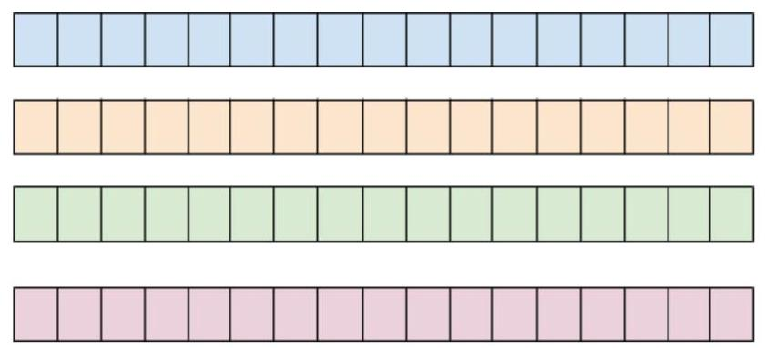
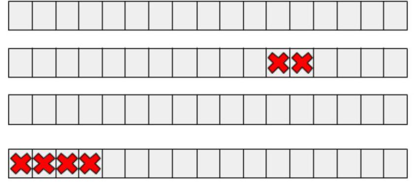
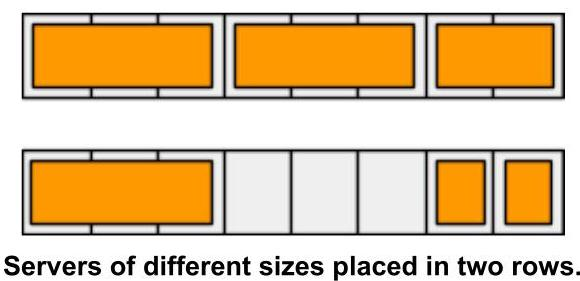
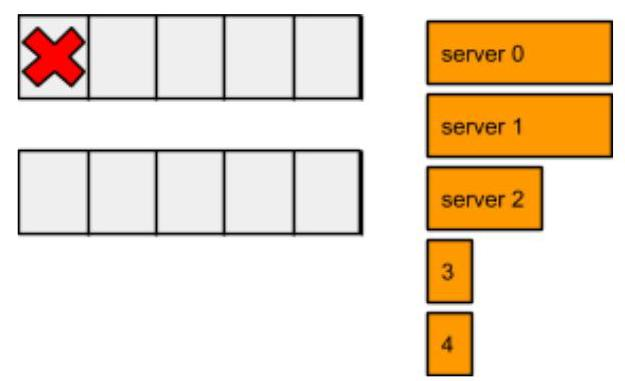
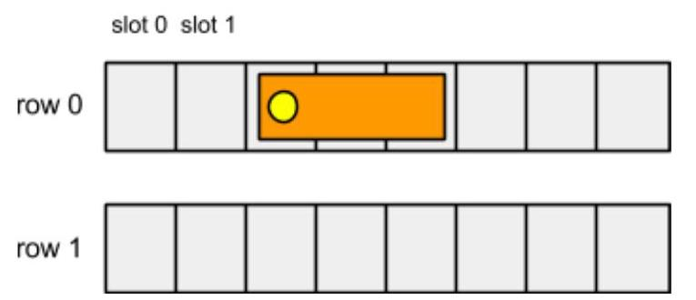
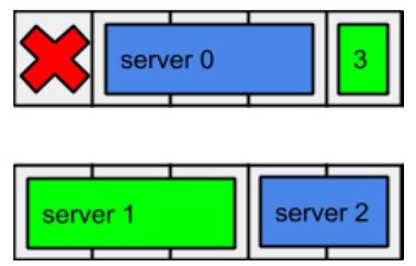
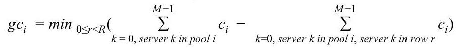

## Hash Code 

by Google France

Problem statement for the Qualification Round, March 12th, 2015

Optimize a Data Center

## Introduction

For over ten years, Google has been building data centers of its own design, deploying thousands of machines in locations around the globe. In each of these locations, batteries of servers are at work around the clock, running services we use every day, from Google Search and YouTube to the judge system of Hash Code.

Data center design is a multi-factor optimization problem. Surely, we want to get as much computing capacity as possible — the services need a lot of resources today and will be asking for more tomorrow. But maximizing the raw capacity is not the only goal: it's equally important to ensure that the computing capacity is provided reliably even in the face of inevitable hardware failures.

## Task

Servers in a data center are physically divided into rows. Rows can share resources such as electric power. If such a shared resource fails, we assume that the entire row is lost and all servers in that row become unavailable.

Servers in a data center are also logically divided into pools. Each server belongs to exactly one pool, and provides it with some amount of computing resources, called capacity. The capacity of a pool is the sum of the capacities of the available servers in that pool.

To ensure reliability of a pool, it is therefore desirable to distribute its servers between different rows. Then, when a row fails, the pool can continue to operate on the servers from the remaining rows (albeit with a reduced capacity because of the unavailable servers). The guaranteed capacity of a pool is the minimum capacity it will have when at most one data center row goes down.

Given a schema of a data center and a list of available servers, your goal is to assign servers to slots within the rows and to logical pools so that the lowest guaranteed capacity of all pools is maximized.

## Problem description

## Slots

A data center is modeled as rows of slots in which servers can be placed. Some of the slots might be unavailable (e.g. because of other installations occupying some of the slots).

A data center with four rows highlighted in different colors.

Six unavailable slots of the data center marked with red crosses.

## Servers

Each server is characterized by its size and capacity. Size is the number of consecutive slots occupied by the machine. Capacity is the total amount of CPU resources of the machine (an integer value).

## Input data

The input data is provided in a plain text file containing exclusively ASCII characters with lines terminated with a single '\\n' character at the end of each line (UNIX-style line endings). The file consists of:

- one line containing the following five natural numbers separated by single spaces:

- $\mathbf{R}\left( {1 \leq  R \leq  {1000}}\right)$ denotes the number of rows in the data center,

- $S\left( {1 \leq  S \leq  {1000}}\right)$ denotes the number of slots in each row of the data center,

- $\mathbf{U}\left( {0 \leq  U \leq  R \times  S}\right)$ denotes the number of unavailable slots,

- $P\left( {1 \leq  P \leq  {1000}}\right)$ denotes the number of pools to be created,

- $M\left( {1 \leq  M \leq  R \times  S}\right)$ denotes the number of servers to be allocated;

- $U$ subsequent lines describing the unavailable slots of the data center. Each of these lines contains two natural numbers separated by a single space: ${r}_{i}$ and ${s}_{i}\left( {0 \leq  {r}_{i} < R,0 \leq  {s}_{i} < S}\right)$ , denoting the row number $\left( {\mathbf{r}}_{i}\right)$ and the slot number within the row $\left( {\mathbf{s}}_{i}\right)$ of the particular unavailable slot;

- $M$ subsequent lines describing the servers to be allocated. Each of these lines contains two natural numbers separated by a single space: ${z}_{i}$ and ${c}_{i}\left( {1 \leq  {z}_{i} \leq  S,1 \leq  {c}_{i} \leq  {1000}}\right)$ , denoting the size of the server $\left( {z}_{i}\right)$ , ie. the number of slots that it occupies, and the capacity $\left( {c}_{i}\right)$ of the machine.

Example

An example input file could look as follows.

<table><tr><td>2 5 1 2 5</td><td>2 rows of 5 slots each, 1 slot unavailable, 2 pools and 5 servers.</td></tr><tr><td>0 0</td><td>Coordinates of the first and only unavailable slot.</td></tr><tr><td>3 10</td><td>First server takes three slots and has a capacity of 10.</td></tr><tr><td>3 10</td><td>So does the second one.</td></tr><tr><td>2 5</td><td>The third one takes two slots and has a capacity of 5.</td></tr><tr><td>1 5</td><td>The fourth one takes just one slot and has a capacity of 5.</td></tr><tr><td>1 1</td><td>The fifth one takes just one slot too and has a capacity of 1.</td></tr></table>

Example input file.

The file above describes a data center of two rows of five slots each and servers of different parameters.

Data center and servers described in the above example.

## Submissions

## File format

A submission file has to be a plain text file containing exclusively ASCII characters with lines terminated with either a single '\\n' character at the end of each line (UNIX-style line endings) or '\\r\\n' characters at the end of each line (Windows-style line endings).

The file has to consists of $\mathbf{M}$ lines describing the allocation of the individual servers, in the same order as they appeared in the input file. Each of these lines has to contain either:

- three natural numbers separated by single spaces: $a{r}_{i}$ , $a{s}_{i}, a{p}_{i}\left( {0 \leq  a{r}_{i} < R,0 \leq  a{s}_{i} < S,0 \leq  a{p}_{i} < P}\right)$ denoting the allocated row $\left( {a{r}_{i}}\right)$ and slot within the row $\left( {a{s}_{i}}\right)$ for the server, and the allocated logical pool for it $\left( {\mathbf{{ap}}}_{i}\right)$ ;

- the single lowercase " $x$ " letter, if the server is left unallocated.

For servers that occupy more than one slot, the slot of the lowest index (leftmost in the picture below) should be indicated as the position of the server.

The position of the three-slot server in the picture should be described as $a{r}_{i} = 0$ and $a{s}_{i} = 2$ .

Example

The following example submission file corresponds to the example input file presented above. Example submission file.

<table><tr><td>0 1 0</td><td>Server 0 placed in row 0 at slot 1 and assigned to pool 0.</td></tr><tr><td>$\begin{array}{lll} 1 & 0 & 1 \end{array}$</td><td>Server 1 placed in row 1 at slot 0 and assigned to pool 1.</td></tr><tr><td>$\begin{array}{lll} 1 & 3 & 0 \end{array}$</td><td>Server 2 placed in row 1 at slot 3 and assigned to pool 0.</td></tr><tr><td>0 4 1</td><td>Server 3 placed in row 0 at slot 4 and assigned to pool 1.</td></tr><tr><td>✘</td><td>Server 4 not allocated.</td></tr></table>

Server layout corresponding to the given example.

## Validation

For the solution to be accepted, it has to meet the following criteria:

- the format of the file has to match the description above,

- each slot of the data center has to be occupied by at most one server,

- no server occupies any unavailable slot of the data center,

- no server extends beyond the slots of the row.

## Score

For each pool, its guaranteed capacity is defined as the lowest total capacity of its running servers when exactly one of the data center rows is unavailable (over all possible rows). The score awarded to the submission is the lowest guaranteed capacity of all pools. The goal is to maximize this score.

## Example

In the example submission given above, the total score is 5 , as the guaranteed capacities of both pools is 5 and $\min \left( {5,5}\right)  = 5$ . See the figure for details.

<table><tr><td/><td>row 0</td><td>row 1</td><td>guaranteed capacity</td></tr><tr><td>pool 0</td><td>10</td><td>5</td><td>5</td></tr><tr><td>pool 1</td><td>5</td><td>10</td><td>5</td></tr></table>

Guaranteed capacities of each pool in the example submission.

## Formally speaking

For $i\left( {0 \leq  i < P}\right)$ , the guaranteed capacity $g{c}_{i}$ can be defined as:

and the total score can be defined as:

$$
\text{ score } = \mathop{\min }\limits_{{0 \leq  i < P}}g{c}_{i}
$$