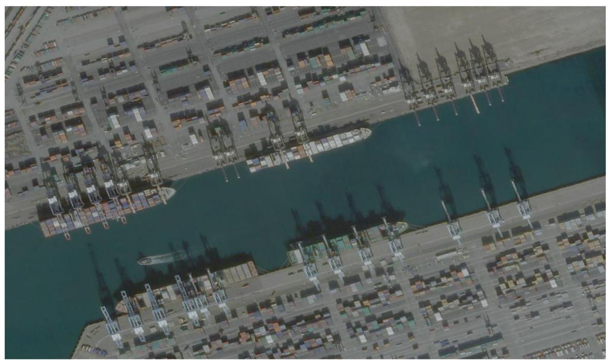
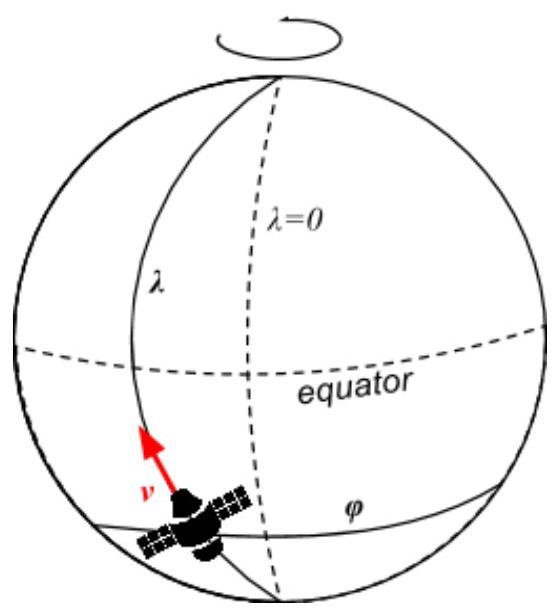

## Hash Code

Satellites

Problem statement for the Final Round, Hash Code 2016

## Introduction

A satellite equipped with a high-resolution camera can be an excellent source of geo imagery. While harder to deploy than a plane or a Street View car, a satellite - once launched - provides a continuous stream of fresh data.

Terra Bella is a new division within Google that deploys and manages high-resolution imaging satellites in order to capture rapidly-updated imagery and analyze them for commercial customers. With a growing constellation of satellites and a constant need for fresh imagery, distributing the work between the satellites is a major challenge.

Example application of satellite geo-imagery:

monitoring economic indicators based on commodity traffic in ports

## Task

Given a set of imaging satellites and a list of image collections ordered by customers, schedule satellite operations so that the total value of delivered image collections is as high as possible.

## Problem description

## Earth

A location on Earth is represented using geographic coordinates ${}^{1}$ as $\left\lbrack  {\varphi ,\lambda }\right\rbrack$ . Both $\varphi$ and $\lambda$ are expressed in integer number of arcseconds. Arcseconds are denoted as " $\left( {{1}^{ \circ  } = {3600}^{\prime \prime }}\right)$ .

- $\varphi$ is latitude and spans between -324000" (corresponding to ${90}^{ \circ  }\mathrm{S}$ ) and ${324000}^{\prime \prime }$ (corresponding to ${90}^{ \circ  }\mathrm{N}$ ).

- $\lambda$ is longitude and spans between $- {648000}^{\prime \prime }$ (corresponding to ${180}^{ \circ  }\mathrm{W}$ ) and ${647999}^{\prime \prime }$ (corresponding to ${179}^{ \circ  }{59}{}^{\prime }{59}{}^{\prime \prime }\mathrm{E}$ ).

For example, the Eiffel Tower has coordinates 48°51′29"N 2°17′40"E. The location of the Eiffel Tower would be represented as [175889, 8260]:

---

latitude: ${3600} * {48}" + {60} * {51}" + {29}" = {175889}$ "

longitude: ${3600} * {2}^{\prime \prime } + {60} * {17}^{\prime \prime } + {40}^{\prime \prime } = {8260}^{\prime \prime }$

---

Rio de Janeiro Olympic Parc has coordinates ${22}^{ \circ  }{58}^{\prime }{40}^{\prime \prime }\mathrm{S}{43}^{ \circ  }{23}^{\prime }{37}^{\prime \prime \prime }\mathrm{W}$ , so its location would be represented as [-82720, -156217]:

latitude: ${3600} * \left( {-{22}^{\prime \prime }}\right)  + {60} * \left( {-{58}^{\prime \prime }}\right)  - {40}^{\prime \prime } =  - {82720}^{\prime \prime }$

longitude: ${3600} * \left( {-{43}^{\prime \prime }}\right)  + {60} * \left( {-{23}^{\prime \prime }}\right)  - {37}^{\prime \prime } =  - {156217}^{\prime \prime }$

## Time

The simulation spans $T$ turns, from 0 to $T - 1$ . Each turn represents one second of simulated time.

## Satellites

We assume that each satellite is on a circular orbit passing through both poles. To describe the orbit of a satellite, we use the following parameters:

- The position of the satellite at turn $0 : \left\lbrack  {\varphi ,\lambda }\right\rbrack$

- The latitude velocity $v$ at turn 0 — the number of latitude arcseconds the satellite travels each turn. This number will be negative or positive, depending on whether the satellite moves towards the North Pole or towards the South Pole at turn 0 . Google

---

${}^{1}$ https://en.wikipedia.org/wiki/Geographic_coordinate_system

---

As the satellite orbits around the Earth, the Earth is rotating beneath it, changing the longitude of each satellite by -15 arcseconds every turn. This corresponds to the Earth rotating by ${360}^{ \circ  }$ in ${24}\mathrm{\;h}$ , as $\left( {{360} * {60} * {60}}\right) /\left( {{24} * {60} * {60}}\right)  = {15}.$

For a satellite that at turn $t$ is at latitude ${\varphi }_{t}$ , longitude ${\lambda }_{t}$ and has latitude velocity ${v}_{t}$ , its location and speed at turn $t + 1$ depends on the latitude:

<table><tr><td/><td>latitude at $t + 1$</td><td>longitude at $t + 1$</td><td>velocity at $t + 1$</td></tr><tr><td>if $- {90}^{ \circ  } \leq  {\varphi }_{t} + {v}_{t} \leq  {90}^{ \circ  }$</td><td>${\varphi }_{t} + {v}_{t}$</td><td>${\lambda }_{t} - {15}^{\prime \prime }$</td><td>${v}_{t}$</td></tr><tr><td>if ${\varphi }_{t} + {v}_{t} > {90}^{ \circ  }$ (satellite flew over the North Pole)</td><td>${180}^{ \circ  } - \left( {{\varphi }_{t} + {v}_{t}}\right)$</td><td>$- {180}^{ \circ  } + \left( {{\lambda }_{t} - {15}^{\prime \prime }}\right)$</td><td>$- {v}_{t}$</td></tr><tr><td>if ${\varphi }_{t} + {v}_{t} <  - {90}^{ \circ  }$ (satellite flew over the South Pole)</td><td>$- {180}^{ \circ  } - \left( {{\varphi }_{t} + {v}_{t}}\right)$</td><td>$- {180}^{ \circ  } + \left( {{\lambda }_{t} - {15}^{\prime \prime }}\right)$</td><td>$- {v}_{t}$</td></tr></table>

If the longitude falls out of the range between -648000" to 647999" (inclusive, corresponding to the range between ${180}^{ \circ  }\mathrm{W}$ and ${179}^{ \circ  }{59}^{\prime }{59}^{\prime \prime }\mathrm{E}$ ), we assume that it "wraps around", e.g. - ${648001}^{\prime \prime } = {647999}^{\prime \prime }$ .

For example, consider a satellite that at turn 0 is at location [176400,7200] (corresponding to ${49}^{ \circ  }\mathrm{N},{2}^{ \circ  }$ E) and travels at velocity of 120 arcseconds per turn.

At turn 1 this satellite will be at [176520, 7185], because the satellite moved 120 arcseconds to the north, while the Earth rotated by 15" beneath it. The velocity of the satellite will still be 120 arcseconds per turn.

At turn 3600 (one hour from the start of the simulation), the satellite will be at [39600, -586800] and will have velocity of -120 arcseconds per turn, as the satellite will have already passed the North Pole. Google

## Camera

We assume that the satellite can rotate independently in two axes. The orientation of the satellite is described by a vector $\left\lbrack  {{\Delta \varphi },{\Delta \lambda }}\right\rbrack$ . In our simplified model, a satellite at location $\left\lbrack  {\varphi ,\lambda }\right\rbrack$ with orientation vector $\left\lbrack  {{\Delta \varphi },{\Delta \lambda }}\right\rbrack$ is pointing its camera at $\left\lbrack  {\varphi  + {\Delta \varphi },\lambda  + {\Delta \lambda }}\right\rbrack$ .

The satellite can change its orientation, at most by $w$ arcseconds in both dimensions between each two subsequent turns, independently in each direction. At any point, both components of the orientation of the satellite $\left\lbrack  {{\Delta \varphi },{\Delta \lambda }}\right\rbrack$ have to be between $- \mathbf{d}$ and $\mathbf{d}$ arcseconds. That is, $- d \leq  {\Delta \varphi },{\Delta \lambda } \leq  d$ .

At turn 0, each satellite has ${\Delta \lambda } = 0,{\Delta \varphi } = 0$ .

You can assume that the satellites won’t be required to take an image of any location above latitude ${85}^{ \circ  }$ (north or south).

Each satellite can take one image per turn at most.

## Images

Images are ordered in collections. Each collection consists of:

- its value in points,

- one or more locations that need to be photographed,

- one or more non-overlapping ranges of allowed turns.

The collection is completed, and its value in points is awarded, if for each of its locations there exists at least one image of this location made within one of the allowed turn ranges (individual images can be taken in different allowed turn ranges).

If multiple image collections contain the same location and their allowed time ranges overlap, it is possible to take a single image that contributes towards completion of multiple collections.

## Input data set

The input data is provided as a data set file - a plain text file containing exclusively ASCII characters with lines terminated with a single '\\n' character at the end of each line (UNIX-style line endings).

## File format

The first line of the data set contains a single natural number $T\left( {1 \leq  T \leq  {604800}}\right)$ , the duration of the simulation in turns.

The next section of the file describes the satellites. This section starts with a single line containing a single natural number $\mathbf{S}\left( {1 \leq  S \leq  {100}}\right)$ . Descriptions of individual satellites follow in $\mathbf{S}$ subsequent lines. Each line describing a satellite contains five integer numbers separated by single spaces:

- $\varphi$ - latitude of the satellite at turn 0 in arcseconds

$\left( {-{324000} \leq  \varphi  \leq  {324000}\text{, which corresponds to} - {90}^{ \circ  } \leq  \varphi  \leq  {90}}\right)$ ,

- λ - longitude of the satellite at turn 0 in arcseconds

$\left( {-{648000} \leq  \lambda  \leq  {647999}\text{, which corresponds to} - {180}^{ \circ  } \leq  \lambda  \leq  {179}^{ \circ  }{59}^{\prime }{59}^{\prime \prime }}\right)$ ,

- $v$ - velocity of the satellite at turn 0 in arcseconds per turn $\left( {{100} \leq  \left| v\right|  \leq  {500}}\right)$ ,

- w - maximum orientation change in each dimension in arcseconds per turn $\left( {0 \leq  w \leq  {200}}\right)$ ,

- d - maximum orientation value in each dimension in arcseconds $\left( {0 \leq  d \leq  {10000}}\right)$ . Google

The next section of the file describes the ordered image collections. This section starts with a single line containing a single natural number $\mathbf{C}\left( {0 \leq  C \leq  {10000}}\right)$ , the number of collections. Descriptions of individual image collections follow. Each collection is described in multiple lines, one after another.

The first line of the image collection description contains three integer numbers, separated by single spaces:

- $V$ - value of the collection $\left( {0 \leq  V \leq  {10000}}\right)$ ,

- $L$ - number of locations to photograph for this collection $\left( {0 < L \leq  {100}}\right)$ ,

- $R$ - number of time ranges during which images for this collection need to be taken $\left( {0 < R \leq  {100}}\right)$ .

Subsequent $L$ lines describe the locations to photograph, each line containing the following numbers separated by single spaces:

- $\varphi$ - latitude of the location in arcseconds $( - {306000} \leq  \varphi  \leq  {306000}$ , which corresponds to $\left. {-{85}^{ \circ  } \leq  \varphi  \leq  {85}^{ \circ  }}\right)$

- $\lambda$ - longitude of the location in arcseconds $( - {648000} \leq  \lambda  \leq  {647999}$ , which corresponds to $\left. {-{180}^{ \circ  } \leq  \lambda  \leq  {179}^{ \circ  }{59}^{\prime }{59}^{\prime \prime }}\right)$

Subsequent $\mathbf{R}$ lines describe time ranges during which the images can be taken: each line containing two integers separated by single spaces: ${t}_{\text{start }}$ and ${t}_{\text{end }}\left( {0 \leq  {t}_{\text{start }} \leq  {t}_{\text{end }} < T}\right)$ . These denote a range of turns (inclusive) in which images for the collection can be taken.

## Example

---

	<table><tr><td>3600</td><td>Simulation lasts an hour.</td></tr><tr><td>2</td><td>Two satellites.</td></tr><tr><td>170000 8300 300 50 500</td><td>First satellite starts at [170000, 8300], heading north.</td></tr><tr><td>180000 8300 -300 50 500 3</td><td>Second satellite starts at [180000, 8300], heading south. Three image collections.</td></tr><tr><td>100 1 1</td><td>First image collection is worth 100 points.</td></tr><tr><td>175958 8387</td><td>The only location: Google office in Paris.</td></tr><tr><td>0 3599</td><td>The image can be taken at any time.</td></tr><tr><td>100 1 2</td><td>Second image collection is worth 100 points.</td></tr><tr><td>175889 8260</td><td>The only location: the Eiffel Tower.</td></tr><tr><td>0 900</td><td>The image has to be taken in the first 15 minutes...</td></tr><tr><td>2700 3599</td><td>...or in the last 15 minutes.</td></tr><tr><td>300 2 1</td><td>Third image collection, worth 300 points.</td></tr><tr><td>175958 8387</td><td>Google office.</td></tr><tr><td>175889 8260</td><td>The Eiffel Tower.</td></tr><tr><td>3300 3599</td><td>The images need to be taken in the last 5 minutes.</td></tr></table>

---

Example input file

## Submissions

## File format

The submission file must start with the number of taken photos $\mathbf{P}$ . $\mathbf{P}$ cannot be bigger than the total number of location entries in all collections. The following $\mathbf{P}$ lines must describe the images taken by satellites in any order. Each image description must contain four integers separated by single spaces:

- φ - latitude of the photographed location in arcseconds

$\left( {-{306000} \leq  \varphi  \leq  {306000}\text{, which corresponds to} - {85}^{ \circ  } \leq  \varphi  \leq  {85}^{ \circ  }}\right)$ ,

- $\lambda$ - longitude of the photographed location in arcseconds

(- ${648000} \leq  \lambda  \leq  {647999}$ , which corresponds to $- {180}^{ \circ  } \leq  \lambda  \leq  {179}^{ \circ  }{59}^{\prime }{59}^{\prime \prime }$ ),

- $t$ - the turn in which the image was taken $\left( {0 \leq  t < T}\right)$ ,

- s - the id of the satellite which took the image. The satellites are numbered in the order in which they appear in the input, starting from 0 .

## Example

---

	<table><tr><td>2 175958 8387 12 1 175889 8260 18 0</td><td>Two pictures taken Google office photographed by satellite number 1 at turn 12 . The Eiffel tower photographed by satellite number 0 at turn 18.</td></tr></table>

---

Example submission file

## Validation

The output file is considered valid if it meets the following criteria:

- The format of the output file matches the description above.

- Each picture is in range of the corresponding satellite when it's taken.

- No satellite moves the camera faster than $\mathbf{w}$ arcseconds per turn between taking two consecutive pictures.

## Scoring

The score will be equal to the sum of points for each collection. Points for a collection are awarded if for all locations listed in the collection, there exists an image taken by a satellite of that location, in one of the turn ranges allowed for the collection.

The example submission above gets ${100} + {100} + 0 = {200}$ points.