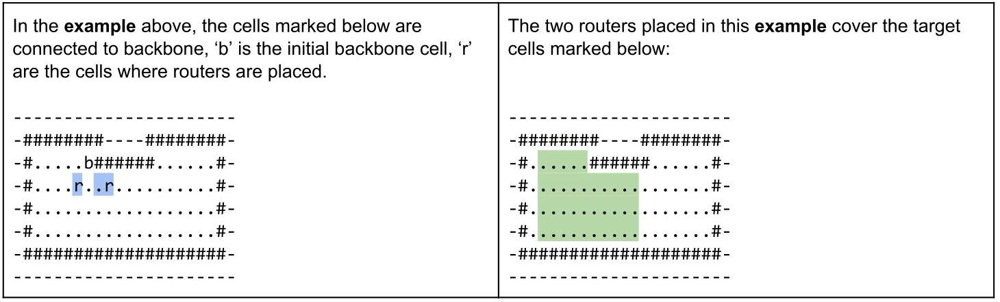

# Hash Code

Router placement

Problem statement for Final Round, Hash Code 2017

## Introduction

Who doesn't love wireless Internet? Millions of people rely on it for productivity and fun in countless cafes, railway stations and public areas of all sorts. For many institutions, ensuring wireless Internet access is now almost as important a feature of building facilities as the access to water and electricity.

Typically, buildings are connected to the Internet using a fiber backbone. In order to provide wireless Internet access, wireless routers are placed around the building and connected using fiber cables to the backbone. The larger and more complex the building, the harder it is to pick router locations and decide how to lay down the connecting cables.

## Task

Given a building plan, decide where to put wireless routers and how to connect them to the fiber backbone to maximize coverage and minimize cost.

## Problem description

## Building

The building is represented as a rectangular grid of cells of $\mathrm{H}$ rows and $\mathrm{W}$ columns. The cells within the grid are referenced using a pair of 0-based coordinates $\left\lbrack  {r, c}\right\rbrack$ , denoting respectively the row and the column of the cell. The cell $\left\lbrack  {0,0}\right\rbrack$ is in the upper-left corner of the grid. For example, the grid below has 4 rows and 5 columns. The cell marked with "X" is [0, 3]. $\ldots X.$ ... ... ... . . . . ... ... Each cell is either:

- a wall cell, represented as "#" in the input file

- a target cell, represented as "." in the input file - these are cells in which we need to have wireless coverage

- a void cell, represented as "-" in the input file - these are cells in which we don't need to have wireless coverage

Each cell (except the cells at the edges of the building) has 8 neighboring cells.

For example, the cell marked with "X" below has the following neighboring cells: ... . . . ... . . $\ldots x\ldots$ ... . . ... . . . .

## Routers

Each router covers a square area of at most ${\left( 2 \times  R + 1\right) }^{2}$ cells around it with Internet access, unless the signal is stopped by a wall cell. Concretely, for a router placed at cell [a, b], the cell [x, y] is covered, provided that:

- $\left| {a - x}\right|  \leq  R$ , and

- $\left| {b - y}\right|  \leq  R$ , and

- there is no wall cell inside the smallest enclosing rectangle of $\left\lbrack  {a, b}\right\rbrack$ and $\left\lbrack  {x, y}\right\rbrack$ . That is, there is no wall cells $\left\lbrack  {\mathrm{w},\mathrm{v}}\right\rbrack$ where both $\min \left( {a, x}\right)  \leq  w \leq  \max \left( {a, x}\right)$ and $\min \left( {b, y}\right)  \leq  v \leq  \max \left( {b, y}\right)$ .

For example, the signal from a router placed in the cell "S" can cover the cell "X" if there are no wall cells in the area marked below. $(R = 7$ in this example) ......... . . S . . . . . . . ......... ......... ......x

For example, if R = 3, the following cells would be covered by a router placed in the cell "S". .#.............. #......#...... ............ ......#..S......... . . . . . # . . . . . . . . . . . . ......#...#...... ......#...#......

Routers can be placed in target or void cells (routers cannot be placed in wall cells).

## Backbone

Routers can be only placed in a cell that is already connected to the fiber backbone (backbone is a cable that delivers Internet to the router itself). In the beginning, exactly one cell in the building is connected to the backbone. The initial backbone cell can be of any type (target, void or wall cell). Google

Cells of any type (target, void or wall cells) can be connected to the backbone. To connect a new cell to the backbone, one of its eight neighboring cells must already be connected to the backbone.

For example, if "b" is the initial cell connected to the backbone, and "r" is a cell where we want to place a router, one of the possible ways of connecting the router to the backbone is connecting all cells marked below.

---

--#...r.#

	-b#...#

	--#....#

---

## Budget

Placing a single router costs the price of ${\mathbf{P}}_{r}$ . Connecting a single cell to the backbone costs the price of ${\mathbf{P}}_{b}$ . The maximum spend on routers and backbone is $\mathbf{B}$ .

For example, if "b" is the initial cell connected to the backbone, we place a single router in the cell "r" and we connect the four cells marked below to the backbone, total cost is $1 \times  {P}_{r} + 4 \times  {P}_{b}$ . This value has to be lower than or equal to $\mathbf{B}$ .

---

--#...r.#

	-b#...#

	--#....#

---

## Input data set

The input data is provided as a data set file - a plain text file containing exclusively ASCII characters with a single "\\n" character at the end of each line (UNIX-style line endings).

## File format

All numbers mentioned in the input are natural numbers that fit within the indicated ranges. When multiple numbers appear in a single line, they are separated by a single space.

The first line contains the following numbers:

- $\mathbf{H}\left( {1 \leq  H \leq  {1000}}\right)$ - the number of rows of the grid

- $W\left( {1 \leq  W \leq  {1000}}\right)$ - the number of columns of the grid

- $\mathbf{R}\left( {1 \leq  R \leq  {10}}\right)$ - radius of a router range

The next line contains the following numbers:

- ${P}_{b}\left( {1 \leq  {P}_{b} \leq  5}\right)$ - price of connecting one cell to the backbone

- ${P}_{r}\left( {5 \leq  {P}_{r} \leq  {100}}\right)$ - price of one wireless router

- $B\left( {1 \leq  B \leq  {10}^{9}}\right)$ - maximum budget

The next line contains the following numbers:

- ${b}_{r},{b}_{c}\left( {0 \leq  {b}_{r} < H,0 \leq  {b}_{c} < W}\right)$ - row and column of the initial cell that is already connected to the backbone Google

The subsequent $\mathbf{H}$ lines describe the grid of the building, one row after another from row 0 to row $H - 1$ .

The description of each row contains $\mathbf{W}$ characters specifying the type of each cell, one column after another from column 0 to column $W - 1$ . Each character is either "#" (denoting a wall cell),"." (denoting a target cell) or "-" (denoting a void cell).

Example

Example input file.

## Submissions

## File format

The submission file must start with a line containing a single number $\mathbf{N}\left( {0 \leq  N < W \times  H}\right)$ - the number of cells connected to the backbone.

$\mathbf{N}$ next lines must specify the cells connected to the backbone, without repetitions and not including the initial cell connected to the backbone that is specified in the problem statement. Each cell in the list must be either neighbors with the initial backbone cell, or must appear in the list after one of its neighbors. Each line in the list has to contain two numbers: $\mathbf{r},\mathbf{c}\left( {0 \leq  r < H,0 \leq  c < W}\right)$ - respectively the row and the column of each cell connected to the backbone.

The next line must contain a single number $\mathbf{M}\left( {0 \leq  M \leq  W \times  H}\right)$ - the number of cells where routers are placed.

$\mathbf{M}$ next lines must specify the cells where routers are placed without repetitions. Each of these lines must contain two numbers: $\mathbf{r},\mathbf{c}\left( {0 \leq  r < H,0 \leq  c < W}\right)$ - respectively the row and the column of each cell where a router is placed.

---

	## Example

	<table><tr><td>3</td><td>three cells connected to the backbone</td></tr><tr><td>3 6</td><td>cell $\left\lbrack  {3,6}\right\rbrack$ neighbors the initial backbone cell $\left\lbrack  {2,7}\right\rbrack$ so can be connected</td></tr><tr><td>3 8</td><td>cell $\left\lbrack  {3,8}\right\rbrack$ also neighbors the initial backbone cell $\left\lbrack  {2,7}\right\rbrack$</td></tr><tr><td>3 9</td><td>cell $\left\lbrack  {3,9}\right\rbrack$ neighbors the cell $\left\lbrack  {3,8}\right\rbrack$ already connected to backbone</td></tr><tr><td>2</td><td>two routers</td></tr><tr><td>3 6</td><td>$\left\lbrack  {3,6}\right\rbrack$ is connected to backbone and not a wall so router can be put there</td></tr><tr><td>3 9</td><td>$\left\lbrack  {3,9}\right\rbrack$ is also connected to backbone and not a wall</td></tr></table>

							Example submission file.

---

Google

## Validation

The output file is valid if it meets the file format specified above and the following criteria:

- all routers are placed in cells connected to the backbone

- no routers are placed in wall cells

- the budget is not exceeded, that is, $N \times  {P}_{b} + M \times  {P}_{r} \leq  B$ .

## Scoring

Each submission earns 1000 points for each target cell covered with Internet access and 1 point for each unit of remaining budget.

If the number of target cells covered is $t$ , the score is computed as follows:

$$
\text{ score } = {1000} \times  t + \left( {B - \left( {N \times  {P}_{b} + M \times  {P}_{r}}\right) }\right)
$$

In the example above, the total number of target cells covered is 35 . The budget is 220, there are 3 additional cells connected to the backbone and 2 routers.

The score of the example submission is therefore ${1000} \times  {35} + \left( {{220} - 3 \times  1 - 2 \times  {100}}\right)$ which equals 35017.

Note that there are multiple data sets representing separate instances of the problem. The final score for your team will be the sum of your best scores on the individual data sets.