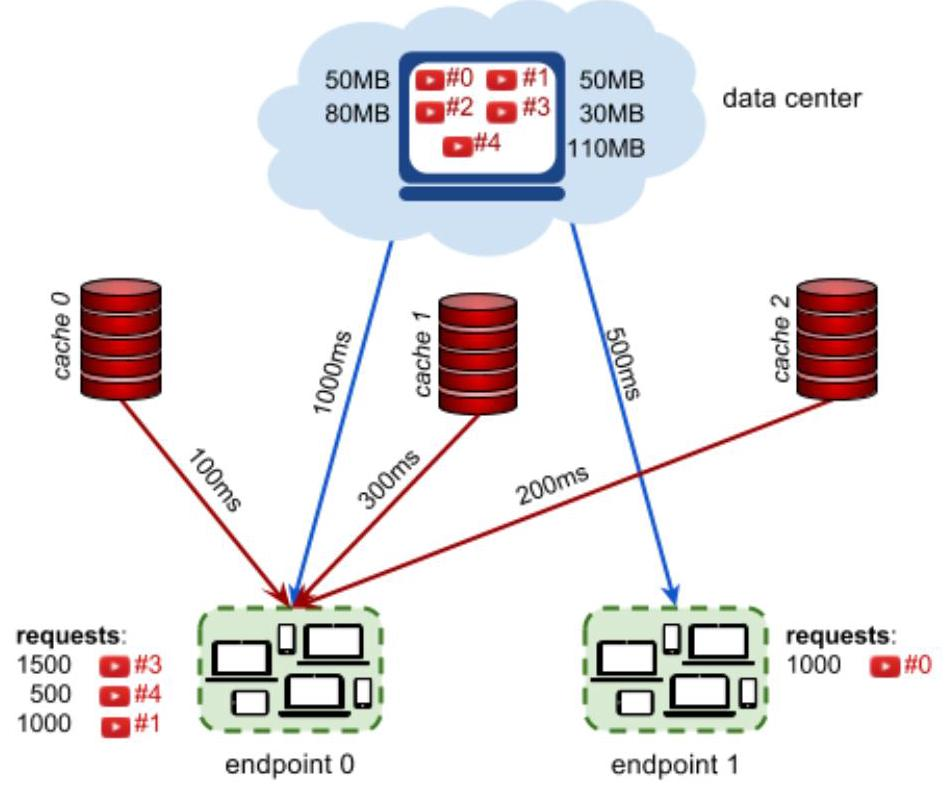

# #Hash Code

Streaming videos

Problem statement for Online Qualification Round, Hash Code 2017

## Introduction

Have you ever wondered what happens behind the scenes when you watch a YouTube video? As more and more people watch online videos (and as the size of these videos increases), it is critical that video-serving infrastructure is optimized to handle requests reliably and quickly.

This typically involves putting in place cache servers, which store copies of popular videos. When a user request for a particular video arrives, it can be handled by a cache server close to the user, rather than by a remote data center thousands of kilometers away.

But how should you decide which videos to put in which cache servers?

## Task

Given a description of cache servers, network endpoints and videos, along with predicted requests for individual videos, decide which videos to put in which cache server in order to minimize the average waiting time for all requests.

## Problem description

The picture below represents the video serving network.

## Videos

Each video has a size given in megabytes (MB). The data center stores all videos. Additionally, each video can be put in 0,1 , or more cache servers. Each cache server has a maximum capacity given in megabytes.

## Endpoints

Each endpoint represents a group of users connecting to the Internet in the same geographical area (for example, a neighborhood in a city). Every endpoint is connected to the data center. Additionally, each endpoint may (but doesn't have to) be connected to 1 or more cache servers.

Each endpoint is characterized by the latency of its connection to the data center (how long it takes to serve a video from the data center to a user in this endpoint), and by the latencies to each cache server that the endpoint is connected to (how long it takes to serve a video stored in the given cache server to a user in this endpoint).

## Requests

The predicted requests provide data on how many times a particular video is requested from a particular endpoint.

## Input data set

The input data is provided as a data set file - a plain text file containing exclusively ASCII characters with a single '\\n' character at the end of each line (UNIX-style line endings).

Videos, endpoints and cache servers are referenced by integer IDs. There are $V$ videos numbered from 0

to $V - 1$ , $\mathrm{E}$ endpoints numbered from 0 to $E - 1$ and $\mathrm{C}$ cache servers numbered from 0 to $C - 1$ .

## File format

All numbers mentioned in the specification are natural numbers that fit within the indicated ranges. When multiple numbers appear in a single line, they are separated by a single space.

The first line of the input contains the following numbers:

- $V\left( {1 \leq  V \leq  {10000}}\right)$ - the number of videos

- $E\left( {1 \leq  E \leq  {1000}}\right)$ - the number of endpoints

- $\mathbf{R}\left( {1 \leq  R \leq  {1000000}}\right)$ - the number of request descriptions

- $C\left( {1 \leq  C \leq  {1000}}\right)$ - the number of cache servers

- $X\left( {1 \leq  X \leq  {500000}}\right)$ - the capacity of each cache server in megabytes

The next line contains $V$ numbers describing the sizes of individual videos in megabytes: ${S}_{0},{S}_{1},\ldots {S}_{V - 1}$ .

${S}_{i}$ is the size of video $i$ in megabytes $\left( {1 \leq  {S}_{i} \leq  {1000}}\right)$ .

The next section describes each of the endpoints one after another, from endpoint 0 to endpoint $E - 1$ . The description of each endpoint consists of the following lines:

- a line containing two numbers:

- ${L}_{D}\left( {2 \leq  {L}_{D} \leq  {4000}}\right)$ - the latency of serving a video request from the data center to this endpoint, in milliseconds

- $K\left( {0 \leq  K \leq  C}\right)$ - the number of cache servers that this endpoint is connected to

- $K$ lines describing the connections from the endpoint to each of the $K$ connected cache servers. Each line contains the following numbers:

$\circ  c\left( {0 \leq  c < C}\right)$ - the ID of the cache server

- ${L}_{c}\left( {1 \leq  {L}_{c} \leq  {500}}\right)$ - the latency of serving a video request from this cache server to this endpoint, in milliseconds. You can assume that latency from the cache is strictly lower than

latency from the data center $\left( {1 \leq  {L}_{c} < {L}_{D}}\right)$ .

Finally, the last section contains $\mathbf{R}$ request descriptions in separate lines. Each line contains the following numbers:

- ${R}_{v}\left( {0 \leq  {R}_{v} < V}\right)$ - the ID of the requested video

- ${R}_{e}\left( {0 \leq  {R}_{e} < E}\right)$ - the ID of the endpoint from which the requests are coming from

- ${R}_{n}\left( {0 < {R}_{n} \leq  {10000}}\right)$ - the number of requests

Example Google

<table><tr><td>5 2 4 3 100 50 50 80 30 110</td><td>5 videos, 2 endpoints, 4 request descriptions, 3 caches 100MB each. Videos 0, 1, 2, 3, 4 have sizes 50MB, 50MB, 80MB, 30MB, 110MB.</td></tr><tr><td>1000 3</td><td>Endpoint 0 has 1000ms datacenter latency and is connected to 3 caches:</td></tr><tr><td>0 100</td><td>The latency (of endpoint 0) to cache 0 is 100ms.</td></tr><tr><td>2 200</td><td>The latency (of endpoint 0) to cache 2 is 200ms.</td></tr><tr><td>1 300</td><td>The latency (of endpoint 0) to cache 1 is 300ms.</td></tr><tr><td>500 0</td><td>Endpoint 1 has 500ms datacenter latency and is not connected to a cache.</td></tr><tr><td>3 0 1500</td><td>1500 requests for video 3 coming from endpoint 0 .</td></tr><tr><td>0 1 1000</td><td>1000 requests for video 0 coming from endpoint 1.</td></tr><tr><td>4 0 500</td><td>500 requests for video 4 coming from endpoint 0 .</td></tr><tr><td>1 0 1000</td><td>1000 requests for video 1 coming from endpoint 0 .</td></tr></table>

Example input file.

Connections and latencies between the endpoints and caches of example input.

## Submissions

## File format

Your submission should start with a line containing a single number $\mathbf{N}\left( {0 \leq  N \leq  C}\right)$ - the number of cache server descriptions to follow.

Each of the subsequent $\mathbf{N}$ lines should describe the videos cached in a single cache server. It should contain the following numbers:

- $c\left( {0 \leq  c < C}\right)$ - the ID of the cache server being described,

- the IDs of the videos stored in this cache server: ${v}_{0},\ldots ,{v}_{n}\left( {0 \leq  {v}_{i} < V}\right)$ (at least 0 and at most $\mathrm{V}$ numbers), given in any order without repetitions

Each cache server should be described in at most one line. It is not necessary to describe all cache servers: if a cache does not occur in the submission, this cache server will be considered as empty. Cache servers can be described in any order.

## Example

<table><tr><td>3</td><td>We are using all 3 cache servers.</td></tr><tr><td>0.2</td><td>Cache server 0 contains only video 2.</td></tr><tr><td>$\begin{array}{lll} 1 & 3 & 1 \end{array}$</td><td>Cache server 1 contains videos 3 and 1.</td></tr><tr><td>$\begin{array}{lll} 2 & 0 & 1 \end{array}$</td><td>Cache server 2 contains videos 0 and 1 .</td></tr></table>

Example submission file.

## Validation

The output file is valid if it meets the following criteria:

- the format matches the description above

- the total size of videos stored in each cache server does not exceed the maximum cache server capacity

## Scoring

The score is the average time saved per request, in microseconds. (Note that the latencies in the input file are given in milliseconds. The score is given in microseconds to provide a better resolution of results.)

For each request description $\left( {{R}_{v},{R}_{e},{R}_{n}}\right)$ in the input file, we choose the best way to stream the video ${R}_{v}$ to the endpoint ${\mathbf{R}}_{\mathrm{e}}$ . We pick the lowest possible latency $L = \min \left( {{L}_{D},{L}_{0},\ldots ,{L}_{k - 1}}\right)$ , where ${\mathrm{L}}_{\mathrm{D}}$ is the latency of serving a video to the endpoint ${\mathbf{R}}_{e}$ from the data center, and ${L}_{0},\ldots ,{L}_{k - 1}$ are latencies of serving a video to the endpoint ${R}_{e}$ from each cache server that:

- is connected to the endpoint ${R}_{e}$ , and

- contains the video ${\mathbf{R}}_{v}$

4

The time that was saved for each request is ${L}_{D} - L$ (This is the time it would take to stream the video from the data center, minus the time it actually took. If the video is in fact streamed from the data center, the time saved is 0 .)

As each request description describes ${\mathbf{R}}_{n}$ requests, the time saved for the entire request description is

$$
{R}_{n} \times  \left( {{L}_{D} - L}\right) \text{.}
$$

To compute the total score for the data set, we sum the time saved for individual request descriptions in milliseconds, multiply by 1000 and divide it by the total number of requests in all request descriptions, rounding down.

A schematic representation of the example submission file above.

In the example above, there are three request descriptions for the endpoint 0 :

- 1500 requests for video 3, streamed from cache 1 with ${300}\mathrm{\;{ms}}$ of latency, saving

1000ms $- {300}\mathrm{{ms}} = {700}\mathrm{{ms}}$ per request

- 500 requests for video 4, streamed from the data center, saving $0\mathrm{\;{ms}}$ per request

- 1000 requests for video 1, streamed from cache 2 with 200ms of latency saving ${800}\mathrm{\;{ms}}$ per request

There is also one request description for the endpoint 1:

- 1000 requests for video 0, streamed from the data center, saving $0\mathrm{\;{ms}}$ per request The average time saved is: Google

$\left( {{1500} \cdot  {700} + {500} \cdot  0 + {1000} \cdot  {800} + {1000} \cdot  0}\right) /\left( {{1500} + {500} + {1000} + {1000}}\right)$

which equals 462.5ms. Multiplied by 1000 , this gives the score of 462500.

Note that there are multiple data sets representing separate instances of the problem. The final score for your team will be the sum of your best scores on the individual data sets.