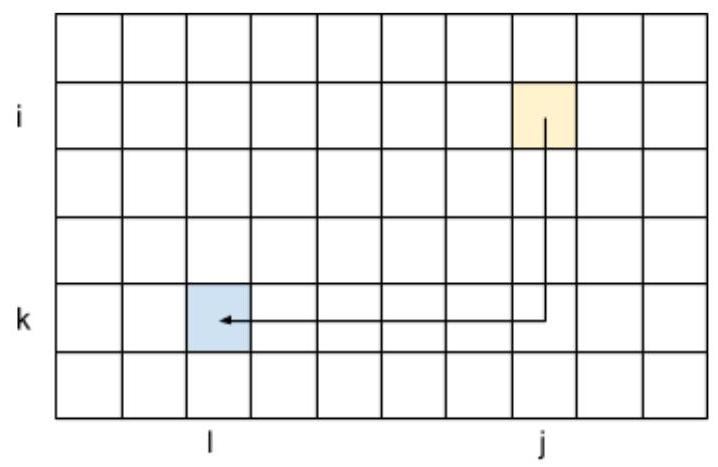

# Hash Code

City Plan

Problem statement for the Final Round of Hash Code 2018 Google

## Introduction

The population of the world is growing and becoming increasingly concentrated in cities. According to the World Bank, global urbanization (the percentage of the world's population that lives in cities) crossed 50% in 2008 and reached ${54}\%$ in ${2016}^{1}$ .

The growth of urban areas creates interesting architectural challenges. How can city planners make efficient use of urban space? How should residential needs be balanced with access to public utilities, such as schools and parks?

## Task

Given a set of building projects, your task is to decide which of the available projects to build and where, in order to maximize residential capacity and availability of utilities to residents.

## Problem description

## City

The city is represented as a rectangular grid of cells of $\mathbf{H}$ rows and $\mathbf{W}$ columns. The cells within the grid are referenced using a pair of 0-based coordinates $\left\lbrack  {\mathbf{r},\mathbf{c}}\right\rbrack$ , denoting the row and the column of the cell, respectively. The cell $\left\lbrack  {0,0}\right\rbrack$ is in the upper-left corner of the grid.

## Building projects

There are two types of building projects available:

- residential - projects of buildings in which residents live. A residential building project is described by:

- its building plan

- its capacity - the number of residents living in the building

- utility - projects of buildings which provide services to district residents. A utility building project is described by:

- its building plan

- its type - an integer number indicating the type of service provided

Multiple utility building projects can provide the same type of service.

## Building plan

Every building project includes a plan of the constructed building.

The plan of the building is represented as a rectangular grid of cells of ${h}_{p}$ rows and ${w}_{p}$ columns. The cells within the grid are referenced using a pair of 0-based coordinates $\left\lbrack  {\mathbf{r},\mathbf{c}}\right\rbrack$ , denoting the row and column of the cell, respectively. The cell $\left\lbrack  {0,0}\right\rbrack$ is the upper-left corner of the grid.

Each cell in the grid is either occupied (represented as '#') or free (represented as '. '). Google Each building plan meets the following conditions:

---

${}^{1}$ https://data.worldbank.org/indicator/SP.URB.TOTL.IN.ZS

---

- at least one cell at each edge of the grid is occupied - there exists at least one occupied cell $\left\lbrack  {0,\mathbf{c}}\right\rbrack$ (for some value of $\mathbf{c}$ ), at least one occupied cell $\left\lbrack  {{h}_{p} - 1,\mathbf{c}}\right\rbrack$ (for some value of $\mathbf{c}$ ), at least one occupied cell $\left\lbrack  {r,{w}_{p} - 1}\right\rbrack$ (for some value of $r$ ) and at least one occupied cell $\left\lbrack  {r,0}\right\rbrack$ (for some value of r).

- the occupied cells form one connected component - any occupied cell can be reached from any other occupied cell by passing one cell at a time between neighboring occupied cells. In this definition, neighboring cells mean two cells that are next to each other, either in the same row or in the same column (so each cell has at most 4 neighbors).

- there are no holes in the building plan - all unoccupied cells are reachable from the building plan border (by passing one cell at a time between neighboring unoccupied cells).

For example, the building plan below has 9 occupied cells, and is represented as a grid of 3 rows and 4 columns.

Below there is a valid building plan that can appear in the problem statement.

####

.#..

####

Below there is an invalid building plan that cannot appear in the problem statement (there is no cell on the left edge of the plan).

... ##

.###

... ##

Below there is another invalid building plan that cannot appear in the problem statement (occupied cells are not connected).

#. ##

.#. .

#. ##

Below there is another invalid building plan that cannot appear in the problem statement (there is a hole in the building plan).

####

#. .#

####

Building plans cannot be rotated or mirrored - we only decide where to place them in the city plan (see below).

## Constructing the projects

Every building project can be constructed 0, 1 , or more times. To construct a building project, one must specify the position of the building in the district plan.

A cell of the city plan is occupied if there's a building which covers it with an occupied cell (represented as '#'). Every city plan cell can be occupied by at most 1 building. A free cell of one building can overlap with an occupied (or a free) cell of another building. All of each building project cells must fit within the city plan.

For example, if we have 2 building plans available:

####.

.#. ... ##

They can be placed on the city plan with 3 rows and 3 columns in the following way:

111

21.

22.

## Walking distance

In the city plan, we define the walking distance $D$ , which specifies the maximum comfortable distance for residents to walk to utility buildings. We assume that residents won't go further than this distance from their residential building to reach utilities.

The distance between two buildings A and B on the city plan is defined as the minimum Manhattan distance between any cell a occupied by the building $A$ and any cell $\mathbf{b}$ occupied by the building $B$ (regardless of whether other cells between $\mathbf{a}$ and $\mathbf{b}$ are occupied and by which building(s)).

The Manhattan distance between two cells $\left\lbrack  {i, j}\right\rbrack$ and $\left\lbrack  {k, l}\right\rbrack$ is defined as $\left| {i - k}\right|  + \left| {j - l}\right|$ .

Manhattan distance between two cells.

For example, if we have 2 building plans available:

###.

.# #

They can be placed on the city plan with 3 rows and 2 columns in the following way:

11

21

22

The distance between them is 1 .

If we place them on the city plan with 5 rows and 6 columns in the following way:

11...

.1...

... ... .

$\ldots 2$ .

... .22

The distance between them is 5 , which represents the Manhattan distance between the bottom right corner cell of the first (blue) building plan ([1,1]) and the top left corner of the second (orange) building ([3,4]).

## Input data set

The input data is provided as a data set file - a plain text file containing exclusively ASCII characters with lines terminated with a single '\\n' character (UNIX-style line endings).

## File format

The first line of the input file contains the following integer numbers separated by single spaces:

- $H$ - number of rows of the city plan $\left( {1 \leq  H \leq  {1000}}\right)$

- $W$ - number of columns of the city plan $\left( {1 \leq  W \leq  {1000}}\right)$

- $D$ - maximum walking distance $\left( {1 \leq  D \leq  {20}}\right)$

- $B$ - number of building projects $\left( {2 \leq  B \leq  {1000}}\right)$

This is followed by $B$ sections describing each building project (one after another, from building project 0 to building project $B - 1$ ).

Each building project $i\left( {0 \leq  i < B}\right)$ , is described by:

- A single line containing the following data:

- ${t}_{p}$ - the type of the building project, a single character ’ $R$ ’ for a residential building or a single character ' $U$ ' for a utility building - ${\mathbf{h}}_{p}$ - the integer number of rows of the building project $\left( {1 \leq  {h}_{p} \leq  \min \left( {H,{50}}\right) }\right)$ ${w}_{p}$ - the integer number of columns of the building project $\left( {1 \leq  {w}_{p} \leq  \min \left( {W,{50}}\right) }\right)$ an integer number that represents a value depending on the type of the building project: for residential buildings: $r$ - the residential capacity of the building $\left( {1 \leq  r \leq  {1000}}\right)$ for utility buildings: $\mathbf{u} -$ an integer representing the service provided by the utility building $\left( {0 \leq  u \leq  {1000}}\right)$

- ${h}_{p}$ lines describing the plan of the building (one row after another from row 0 to row ${\mathbf{h}}_{p}$ - 1). Each of those lines contains ${w}_{p}$ characters specifying the type of each cell of the row: ’ $\#$ ’ for occupied cells or ’. ’ for free cells (one cell after another from column 0 to column ${w}_{p} - 1$ )

There is at least one residential building project and at least one utility building project in each data set.

## Example

---

	<table><tr><td>$\begin{array}{llll} 4 & 7 & 2 & 3 \end{array}$ R 3 2 25 .# ## .# U 1 4 1 #### U 2 2 5 ## ##</td><td>4 rows, 7 columns, 2 is the maximum walking distance, 3 building plans. Project 0: residential type, 3 rows, 2 columns, capacity is 25. Occupied cells are: [0,1], [1,0], [1,1], [2,1]. Project 1: utility type, 1 row, 4 columns, utility type is 1. Occupied cells are: [0,0], [0,1], [0,2], [0,3]. Project 2: utility type, 2 rows, 2 columns, utility type is 5. Occupied cells are: [0,0], [0,1], [1,0], [1,1].</td></tr></table>

					Example input file.

---

## Submissions

## File format

The submission file must start with a line containing a single integer number $\mathbf{N}\left( {0 \leq  N \leq  H \times  W}\right)$ - the number of buildings to be placed on the city map.

This must be followed by $\mathbf{N}$ lines describing each constructed building. Each of those lines must contain the following numbers separated by spaces:

- ${b}_{i}$ - number of the building project used, corresponding to the 0-based index of the building project in the input file $\left( {0 \leq  {b}_{i} < B}\right)$

- ${r}_{i}$ - row of the top-left corner of the building plan placed in the city plan $\left( {0 \leq  {r}_{i} < H}\right)$

- ${c}_{i}$ - column of the top-left corner of the building in the city plan coordinates $\left( {0 \leq  {c}_{i} < W}\right)$

## Example

---

	<table><tr><td>4 $\left\lbrack  \begin{matrix} 0 & 0 & 0 \end{matrix}\right\rbrack$ $\begin{array}{lll} 1 & 3 & 0 \end{array}$ $\begin{array}{lll} 2 & 0 & 2 \end{array}$ 0 0 5</td><td>4 buildings to be placed 1 ${}^{\text{st}}$ : Project 0, left top corner at $\left\lbrack  {0,0}\right\rbrack$ ${2}^{\text{nd }}$ : Project 1, left top corner at $\left\lbrack  {3,0}\right\rbrack$ ${3}^{\text{rd }}$ : Project 2, left top corner at $\left\lbrack  {0,2}\right\rbrack$ ${4}^{\text{th }} :$ Project 0, left top corner at $\left\lbrack  {0,5}\right\rbrack$ Here is a simple visualization of the submission file, if we mark all occupied cells on the city plan with the building index: .133..4 1133.44 .1...4 2222...</td></tr></table>

---

Example submission file.

## Validation

In order for the submission to be accepted, it must meet the file format specified above and follow the rules of placing the buildings on the city plan.

## Scoring

For every residential building with a capacity $\mathbf{r}$ placed on the map, the submission will earn $\mathbf{r}$ points for every type of utility service accessible to the residents of that building. (If there are two or more utility buildings providing the same type of service, the residential building still earns only $\mathbf{r}$ points for this type of service.)

A type of service is accessible to the residents if there exists a utility building providing the service of that type with the shortest Manhattan distance between the residential building in question and the utility building of at most $D$ .

For example, with the input file and the submission files above, the score of the submission is 75 points:

There is a total of 4 buildings, 2 residential and 2 utilities.

1. The first residential building (1st building, placed at $\left\lbrack  {0,0}\right\rbrack$ ) is:

- at distance 1 from a utility of type ' 1 ' (the 2nd building, placed at [3,0])

- at distance 1 from a utility of type '5' (the 3rd building, placed at [0,2])

Since its capacity is 25 , and it is at a distance of at most D from two types of utilities, the score for this building is $2 * {25} = {50}$ .

2. The second residential building (4th building, placed at [0,5]) is:

- at distance 4 from a utility of type ' 1 ' (the 2nd building, placed at [3,0])

- at distance 2 from a utility of type '5' (the 3rd building, placed at [0,2])

Since its capacity is 25 , and it is at a distance of at most D for only one type of utility, the score for this building is $1 * {25} = {25}$ .

Thus, the total score of this city plan is ${50} + {25} = {75}$ points.

Note that there are multiple data sets representing separate instances of the problem. The final score for your team will be the sum of your best scores on the individual data sets.