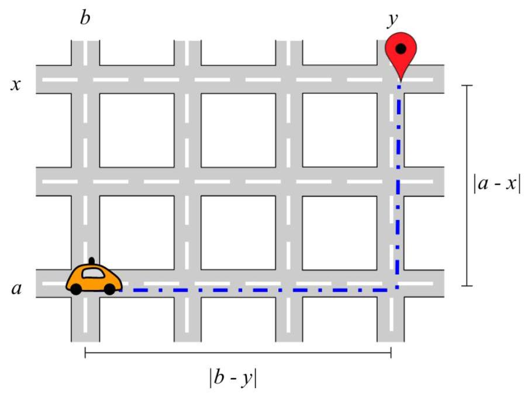

# Hash Code

Self-driving rides

Problem statement for the Online Qualification Round of Hash Code 2018 Google

## Introduction

Millions of people commute by car every day; for example, to school or to their workplace.

Self-driving vehicles are an exciting development for transportation. They aim to make traveling by car safer and more available while also saving commuters time.

In this competition problem, we'll be looking at how a fleet of self-driving vehicles can efficiently get commuters to their destinations in a simulated city.

## Task

Given a list of pre-booked rides in a city and a fleet of self-driving vehicles, assign the rides to vehicles, so that riders get to their destinations on time.

For every ride that finishes on time (or early), you will earn points proportional to the distance of that ride; plus an additional bonus if the ride also started precisely on time.

## Problem description

## Map

The city is represented by a rectangular grid of streets, with $\mathbf{R}$ horizontal streets (rows) and $\mathbf{C}$ vertical streets (columns). Street intersections are referenced by integer, 0-based coordinates of the horizontal and the vertical street. For example, $\left\lbrack  {\mathbf{r},\mathbf{c}}\right\rbrack$ means the intersection of the $\mathbf{r}$ -th horizontal and the $\mathbf{c}$ -th vertical street $\left( {0 \leq  r < R,0 \leq  c < C}\right)$ . Vehicles

Example city of 3 horizontal and 4 vertical streets.

There are $\mathbf{F}$ vehicles in the fleet. At the beginning of the simulation, all vehicles are in the intersection [0,0]. There is no limit to how many vehicles can be in the same intersection. Google

## Time and distance

The simulation proceeds in $T$ steps, from 0 to $T - 1$ .

The distance between two intersections is defined as the minimum total number of city blocks (cells in the grid) that a vehicle has to pass in each direction to get from one intersection to the other. That is, the distance between intersection $\left\lbrack  {a, b}\right\rbrack$ and intersection $\left\lbrack  {x, y}\right\rbrack$ is equal to $\left| {a - x}\right|  + \left| {b - y}\right|$ .

The number of steps required to drive between two intersections is equal to the distance between them.

## Rides

There are $\mathbf{N}$ pre-booked rides.

Each ride is characterized by the following information:

- start intersection - to begin the ride, the vehicle must be in this intersection.

- finish intersection - to end the ride, the vehicle must be in this intersection. Finish intersection is always different than start intersection.

- earliest start - the earliest step in which the ride can start. It can also start at any later step.

- latest finish - the latest step by which the ride must finish to get points for it.

- Note that the given "latest finish" step is the step in which the ride must already be over (and not the last step in which the vehicle moves) - see example below.

For example, let's consider a ride with distance 3 , earliest start 0 and latest finish 3.

If a vehicle starts the ride at step 0 , the vehicle arrives on time (the vehicle travels at steps 0, 1, 2).

If the vehicle starts the ride at step 1 , it does not arrive on time.

You must decide which of the rides each vehicle will handle, and in what order.

## Simulation

Each vehicle makes the rides you assign to it in the order that you specify:

- first, the vehicle drives from its current intersection $(\left\lbrack  {0,0}\right\rbrack$ at the beginning of the simulation) to the start intersection of the next ride (unless the vehicle is already in this intersection)

- then, if the current step is earlier than the earliest start of the next ride, the vehicle waits until that step

- then, the vehicle drives to the finish intersection

- the vehicle does this even if the arrival step is later than the latest finish; but no points are earned by such a ride

- then, the process repeats for the next assigned ride, until the vehicle handles all scheduled rides or the simulation reaches its final step $T$ (whichever comes first)

- any remaining assigned rides are simply ignored

For example, if a vehicle is assigned to handle a single ride of the following parameters: - start intersection: $\left\lbrack  {1,2}\right\rbrack$ - finish intersection: $\left\lbrack  {1,4}\right\rbrack$ - earliest start: 5 - latest finish: 8

Then the simulation proceeds as follows:

- in steps 0,1 and 2 the vehicle drives to $\left\lbrack  {1,2}\right\rbrack$

- in steps 3 and 4 the vehicle waits until the earliest start in step 5

- in steps 5 and 6 the vehicle drives to the finish intersection

- in step 7 the ride is finished, one step before the deadline

Whenever a vehicle is moving between intersections, it is making at most one ride. (In this simulation we're not considering pooling multiple rides at the same time in a single vehicle.) A vehicle can start a new ride in the same step in which the previous ride is finished, if the new ride starts in the same intersection that the previous ride finished in.

For example, let's consider a ride with distance 3 , earliest start 0 and latest finish 3 . If a vehicle starts a ride at step 0 , it travels at steps 0, 1 and 2 . In step 3 the ride is finished and it is allowed to start a new ride in step 3 .

## Input data set

The input data is provided as a data set file - a plain text file containing exclusively ASCII characters with lines terminated with a single "\\n' character (UNIX-style line endings).

## File format

The first line of the input file contains the following integer numbers separated by single spaces:

- $R$ - number of rows of the grid $\left( {1 \leq  R \leq  {10000}}\right)$

- $C$ - number of columns of the grid $\left( {1 \leq  C \leq  {10000}}\right)$

- $F$ - number of vehicles in the fleet $\left( {1 \leq  F \leq  {1000}}\right)$

- $N$ - number of rides $\left( {1 \leq  N \leq  {10000}}\right)$

- $B$ - per-ride bonus for starting the ride on time $\left( {1 \leq  B \leq  {10000}}\right)$

- $T$ - number of steps in the simulation $\left( {1 \leq  T \leq  {10}^{9}}\right)$

$N$ subsequent lines of the input file describe the individual rides, from ride 0 to ride $N - 1$ . Each line contains the following integer numbers separated by single spaces:

- a - the row of the start intersection $\left( {0 \leq  a < R}\right)$

- $b$ - the column of the start intersection $\left( {0 \leq  b < C}\right)$

- $x$ - the row of the finish intersection $\left( {0 \leq  x < R}\right)$

- $y$ - the column of the finish intersection $\left( {0 \leq  y < C}\right)$

- $s -$ the earliest start $\left( {0 \leq  s < T}\right)$

- $f$ - the latest finish $\left( {0 \leq  f \leq  T}\right) ,\left( {f \geq  s + \left| {x - a}\right|  + \left| {y - b}\right| }\right)$

- note that $f$ can be equal to $T$ - this makes the latest finish equal to the end of the simulation

The finish intersection is always different from the start intersection (the two can be in the same column, or in the same row, but not in the same column and in the same row).

## Example

---

	<table><tr><td>3 4 2 3 2 10</td><td>3 rows, 4 columns, 2 vehicles, 3 rides, 2 bonus and 10 steps</td></tr><tr><td>00 1 3 2 9</td><td>ride from [0, 0] to [1, 3], earliest start 2, latest finish 9</td></tr><tr><td>1 2 1 0 0 9</td><td>ride from [1, 2] to [1, 0], earliest start 0, latest finish 9</td></tr><tr><td>202209</td><td>ride from [2, 0] to [2, 2], earliest start 0, latest finish 9</td></tr></table>

---

Example input file.

## Submissions

## File format

The submission file must contain $\mathbf{F}$ lines, one for each vehicle in the fleet.

Each line describing the rides of a vehicle must contain the following integers separated by single spaces:

- $M$ - number of rides assigned to the vehicle $\left( {0 \leq  M \leq  N}\right)$

- ${R}_{0},{R}_{1},\ldots ,{R}_{M - 1} -$ ride numbers assigned to the vehicle, in the order in which the vehicle will perform them $\left( {0 \leq  {R}_{i} < N}\right)$

Any ride can be assigned to a vehicle at most once. That is, it is not allowed to assign the same ride to two or more different vehicles. It is also not allowed to assign the same ride to one vehicle more than once.

It is not required to assign all rides to vehicles - some rides can be skipped.

## Example

<table><tr><td>1 0 2 2 1</td><td>this vehicle is assigned 1 ride: [0] this vehicle is assigned 2 rides: [2, 1]</td></tr><tr><td colspan="2">Example submission file.</td></tr></table>

## Validation

In order for the submission to be accepted, it must follow the format requirements described above.

## Scoring

Each ride completed before its latest finish earns the number of points equal to the distance between the start intersection and the finish intersection.

Additionally, each ride which started exactly in its earliest allowed start step gets an additional timeliness bonus of $B$ .

The total score of the submission is the sum of all points earned by all rides completed by all vehicles.

For example, with the example input file and the example submission file above, there are two vehicles.

Vehicle 0 handles one ride:

- ride 0, start at step 2, finish at step 6 . Earns points: 4 (distance) +2 (bonus) = 6

Vehicle 1 handle two rides:

- ride 2, start at step 2, finish at step 4. Earns points: 2 (distance) +0 (no bonus) = 2

- ride 1, start at step 5 , finish at step 7 . Earns points: 2 (distance) +0 (no bonus) = 2

The total score for this submission is $6 + 2 + 2 = {10}$ .

Note that there are multiple data sets representing separate instances of the problem. The final score for your team will be the sum of your best scores on the individual data sets. Google