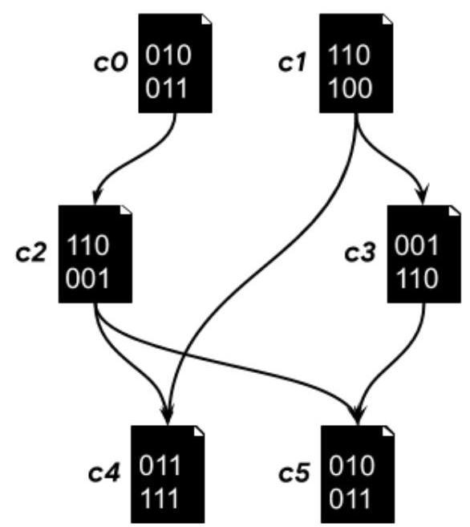
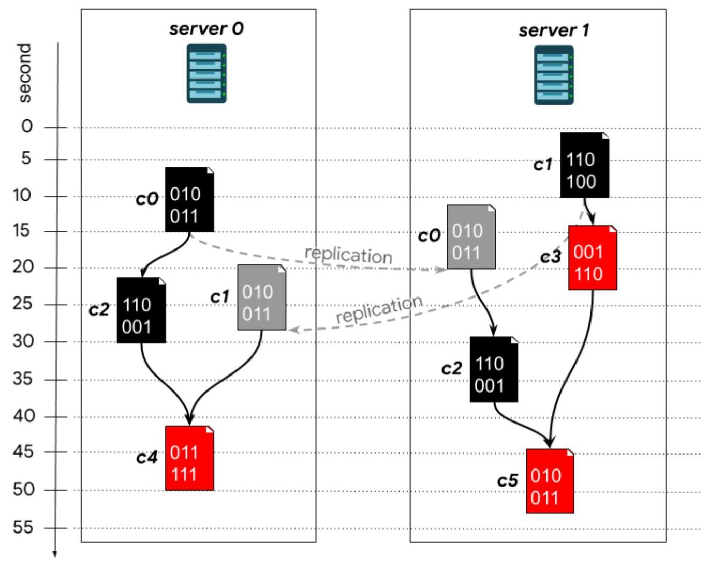

# Hash Code

Compiling Google

Problem statement for the Final Round of Hash Code 2019

## Introduction

Google has a large codebase, containing billions of lines of code across millions of source files. From these source files, many more compiled files are produced, and some compiled files are then used to produce further compiled files, and so on.

Given the huge number of files, compiling them on a single server would take a long time. To speed it up, Google distributes the compilation steps across multiple servers.

In this problem, we will explore how to effectively use multiple compilation servers to optimize compilation time.

## Task

Given a description of dependencies between files in a massive codebase, a number of build servers, and deadlines for the compilation targets, schedule the compilation steps on the available servers.

## Problem description

## Compiled files

In this problem, we only deal with compiled files, which are produced by compilation steps.

Each compiled file is described by: name, dependencies (other compiled files that need to be ready before this file can be compiled), the time it takes to replicate the file to all other servers, and the time it takes to compile it.

Dependencies between compiled files form a directed acyclic graph with edges from a dependency to the compiled file (see Figure 1 below). The list of dependencies can be empty.

Figure 1. A set of compiled files (c0-c5) and their dependencies. The edge from c0 to c2 indicates that c0 is required to compile c2.

For example, in Figure 1, in order to start compiling c4, a server needs to have both c1 and c2 available first. If any of these files are not compiled on the same server but on a different one, the server needs to wait until their replication has finished (see the Replication section below).

## Compilation steps

Compiled files are produced by servers executing compilation steps. Each server can execute at most one compilation step at a time. Each step produces a single compiled file and takes the amount of time determined by the co9mpilation time of the file being compiled.

Servers are independent, which means that two compilation steps can run in parallel if they are executed on different servers.

## Replication

When a compiled file is first produced, it is only available on the server that compiled it. Replication starts automatically once the file is compiled: copies of the file are sent to all other servers, and become available to them after the replication time (defined for each file - see the Input data set section below) has passed.

For example, suppose that file $\mathbf{{c0}}$ has a compilation time of $\mathbf{{23s}}$ (23 seconds) and a replication time of ${40}\mathrm{\;s}$ . If we start compiling it at server 0 starting at second 0 , then it will be available on server 0 at second 23 , and on all the other servers at second 63 (23s + 40s).

A single file can be independently compiled by multiple servers (and it might be useful, if the file takes longer to replicate than to compile). All servers will be able to use the file as soon as the first copy has been replicated - see the Dependencies section below for details.

## Dependencies

In your submission, you will specify compilation steps to be executed on each server. On each server, the steps are executed in the order that they appear in your submission, possibly waiting for dependencies to be ready and replicated.

Each compilation step starts as soon as all of the following conditions are met:

- the server completed all previous compilation steps assigned to it

- all dependencies (other compiled files) required for the compilation step are available on the server - taking into account only the compilation steps specified earlier in your submission (see the Submissions section below). Note that:

- files compiled earlier on the same server are immediately available

- other files are available when they are compiled by another server and their replication is finished

## Target files

The problem input will specify a list of target files. Each target file is one of the compiled files (see above) and is described by the following parameters:

- deadline - the latest time at which the file needs to be compiled (on at least one server, excluding replication time) to get a positive score for that target

- goal points - fixed number of points that will be given for compiling the file within the deadline (in addition to speed points which depend on how fast the file is compiled - see details in the Scoring section below)

For example, suppose a target file has a deadline of 50s, a compilation time of 40s and no dependencies. In order to score points for this target file, we need to start compiling it no later than at second 10 .

The target files are a non-empty subset of all compiled files.

Note: time starts at second 0 . Any compilation steps can start immediately on that time instant. All deadlines, compilation and replication times are in whole seconds.

It's not required to compile all target files - the target files that are not compiled at all or compiled too late simply don't earn points.

## Input data set

## File format

Each input data set is provided in a plain text file containing exclusively ASCII characters with lines terminated with a single '\\n' character (UNIX-style line endings). When multiple elements are stored in one line, they are each separated by a single space.

The first line of the data set contains the following data:

- an integer $C\left( {1 \leq  C \leq  {10}^{5}}\right)$ - the number of compiled files

- an integer $T\left( {1 \leq  T \leq  C}\right)$ - the number of target files

- an integer $S\left( {1 \leq  S \leq  {100}}\right)  -$ the number of available servers

This is followed by $\mathbf{C}$ sections (two lines each) describing individual compiled files:

- a line containing the following elements:

- the name of the compiled file - an alphanumeric string (1 to 10 characters, ASCII letters and digits only), the names of the compiled files are unique

- $\mathbf{c}\left( {1 \leq  \mathbf{c} \leq  {10}^{6}}\right)$ - time required to compile it

- $r\left( {1 \leq  r \leq  {10}^{6}}\right)  -$ time required to replicate it

- a line describing its dependencies (other compiled files required to compile this file):

- an integer $\mathbf{n}\left( {0 \leq  \mathbf{n} \leq  {100}}\right)$ - number of dependencies

- if $n > 0$ : following $n$ space-separated names of the dependencies. It is guaranteed that all the dependencies are described earlier in the input file.

Finally, the last T lines describe the target files. Each line contains:

- an alphanumeric string - the name of the compiled file

- d $\left( {1 \leq  d \leq  {10}^{6}}\right)$ - the deadline by which the target file needs to be compiled

- $g\left( {1 \leq  g \leq  {10}^{6}}\right)  -$ goal points that will be earned for compiling this file within the deadline

A compiled file can be referenced as a target at most once.

Example

<table><tr><td>Input file</td><td>Description</td></tr><tr><td>6 3 2</td><td>6 files, 3 targets, 2 servers</td></tr><tr><td>c0 15 5 0</td><td>Compiled file c0, needs 15s to compile, 5s to replicate and has no dependencies</td></tr><tr><td>c1 10 18 0</td><td>Compiled file c1, needs 10s to compile, 18s to replicate and has no dependencies</td></tr><tr><td>c2 15 35 1 co</td><td>Compiled file c2, needs 15s to compile, 35s to replicate and has 1 dependency: file c0</td></tr><tr><td>c3 13 52 1 c1</td><td>Compiled file c3, needs 13s to compile, 52s to replicate and has 1 dependency: file c1</td></tr><tr><td>c4 20 52</td><td>Compiled file c4, needs 20s to compile, 52s to replicate</td></tr><tr><td>2 c1 c2</td><td>and has 2 dependencies: files c1 and c2</td></tr><tr><td>c5 15 21</td><td>Compiled file c5, needs 15s to compile, 21s to replicate</td></tr><tr><td>$2\;\mathrm{c}2\;\mathrm{c}3$</td><td>and has 2 dependencies: files c2 and c3</td></tr><tr><td>c3 40 8</td><td>Target file c3 has deadline 40s, and 8 goal points</td></tr><tr><td>c4 45 15</td><td>Target file c4 has deadline 45s, and 15 goal points</td></tr><tr><td>c5 53 35</td><td>Target file c5 has deadline 53s, and 35 goal points</td></tr></table>

## Submissions

## File format

Your submission should describe how the compilation process is distributed.

The submission file must start with a line with a single integer $\mathbf{E}\left( {1 \leq  \mathbf{E} \leq  \mathbf{C} \times  \mathbf{S}}\right)$ - the number of executed compilation steps, followed by $\mathbf{E}$ lines, each containing:

- the name of the file being compiled

- s - the index of the server that performs the compilation step $\left( {O \leq  s < S}\right)$ .

It is allowed to have the same compilation step listed multiple times (but note that compiling the same file on the same server more than once is never useful).

Remember that the dependencies of each compilation step have to be produced by at least one of the compilation steps that appear earlier in the submission file - see the Dependencies section above.

## Example

<table><tr><td>Submission file</td><td>Description</td></tr><tr><td>7</td><td>7 compilation steps</td></tr><tr><td>c1 1</td><td>c1 is compiled on server 1</td></tr><tr><td>CO 0</td><td>c0 is compiled on server 0</td></tr><tr><td>c3 1</td><td>c3 is compiled on server 1</td></tr><tr><td>C2 0</td><td>c2 is compiled on server 0</td></tr><tr><td>c2 1</td><td>c2 is compiled on server 1</td></tr><tr><td>C4 0</td><td>c4 is compiled on server 0</td></tr><tr><td>c5 1</td><td>c5 is compiled on server 1</td></tr></table>

Figure 2. Example submission corresponding to the example file above. Files in red are the target files. Files in black are compiled files compiled on the given server. Files in grey are copies of compiled files that were compiled on another server and replicated to the given server. The bottom of each file icon corresponds to the time at which it is ready.

In the figure above, the compilation of files $\mathrm{c}0$ and $\mathrm{c}1$ starts as soon as possible: at second 0 . From the input in the example above, c0 is ready on server 0 at second 15 (needs 15s to compile) and c1 on server 1 at second 10. Compilation of file c3 on server 1 can start at second 10, when c1 - its only dependency - is available. Since c3 needs 13s to compile, it is available at second 23 (13 + 10).

File c2 is compiled in both servers. On server 0 , its dependency (c0) is available at second 15 and c2 is produced 15s later. On server 1, c0 is initially not available and thus is replicated from server 0 . The replication step takes 5 s. Even though c0 is available on server 1 at second 20, compilation of c2 cannot start immediately: c3 is being compiled

between seconds 10 and 23. Once the previous step has finished, c2 can be compiled on server 1.

Similarly, c4 is ready on server 0 at second 50 and c5 on server 1 at second 53 .

## Scoring

For each target file with deadline $\mathbf{d}$ and goal points $\mathbf{g}$ and for which compilation completes at second $\mathbf{x}$ , the submission earns points only if $\mathbf{x} \leq  \mathbf{d}$ . The points earned are a sum of:

- speed points: $\mathbf{d} - \mathbf{x}$ ,

- goal points: $\mathbf{g}$

So in total, a target file earns $d - x + g$ if it has been compiled by the deadline, or 0 if it has not been compiled at all, or is compiled after the deadline.

The final score of a data set is the sum of scores earned for each of the target files.

---

For example, in the example above, only targets c3 and c5 are produced in time:

	- c3 is ready at second 23 , while the deadline is 40 . The deadline is met, earning

		8 goal points and 17 speed points.

		score(c3) $= \left( {{40} - {23}}\right)  + 8 = {25}$

	- c4 is ready at second 50 , while the deadline is 45 . The deadline is not met, so

		no points are earned

	- c5 is ready at second 53 , precisely at the deadline. The deadline is met,

		earning 35 goal points and 0 speed points.

		score $\left( {c5}\right)  = \left( {{53} - {53}}\right)  + {35} = {35}$

The total score for this submission is ${25} + 0 + {35} = {60}$

---

Note that there are multiple data sets representing separate instances of the problem. The final score for your team will be the sum of your best scores for the individual data sets.