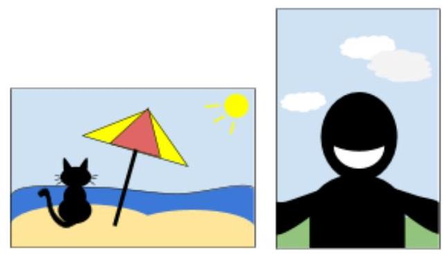
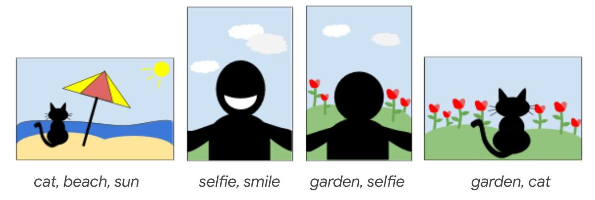
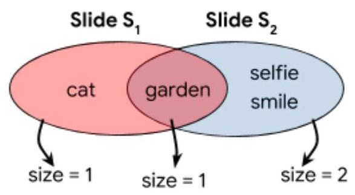

# hash code  Photo slideshow  Problem statement for the Online Qualification Round of Hash Code 2019

## Introduction

As the saying goes, "a picture is worth a thousand words." We agree - photos are an important part of contemporary digital and cultural life. Approximately 2.5 billion ${}^{1}$ people around the world carry a camera - in the form of a smartphone - in their pocket every day. We tend to make good use of it, too, taking more photos than ever (back in 2017, Google Photos announced it was backing up more than 1.2 billion photos and videos per day ${}^{2}$ ).

The rise of digital photography creates an interesting challenge: what should we do with all of these photos? In this competition problem, we will explore the idea of composing a slideshow out of a photo collection.

## Task

Given a list of photos and the tags associated with each photo, arrange the photos into a slideshow that is as interesting as possible (the scoring section below explains what we mean by "interesting").

## Problem description

## Photos

A photo is described by a set of tags.

For example, a photo with a cat on a beach, during a sunny afternoon could be tagged with the following tags: [cat, beach, sun].

---

${}^{1}$ https://www.statista.com/statistics/330695/number-of-smartphone-users-worldwide/

${}^{2}$ https://www.blog.google/products/photos/google-photos-500-million-new-sharing/

---

Each photo's orientation is either horizontal or vertical.

the photo on the left is horizontal, while the photo on the right is vertical

## Slideshow

A slideshow is an ordered list of slides. Each slide contains either:

- a single horizontal photo, or

- two vertical photos side-by-side

If the slide contains a single horizontal photo, the tags of the slide are the same as the tags of the single photo it contains.

For example, a slide containing a single horizontal photo with tags [cat, beach, sun], has tags [cat, beach, sun].

If the slide contains two vertical photos, the tags of the slide are all the tags present in any or both of the two photos it contains.

For example, a slide containing two vertical photos with tags [selfie, smile] for the first photo, and tags [garden, selfie] for the second photo, has tags [selfie, smile, garden].

Each photo can be used either once or not at all. The slideshow must have at least one slide.

## Input data set

## File format

Each input data set is provided in a plain text file containing exclusively ASCII characters with lines terminated with a single '\\n' character (UNIX-style line endings).

The first line of the data set contains a single integer $N\left( {1 \leq  N \leq  {10}^{5}}\right)$ - the number of photos in the collection.

This is followed by $N$ lines, where line $i$ contains a description of the photo with ID $i$ $\left( {0 \leq  i < N}\right)$ . The description of photo $i$ contains the following data, separated by a single space:

- A single character ’ $\mathrm{H}$ ’ if the photo is horizontal, or ’ $\mathrm{V}$ ’ if it is vertical.

- An integer ${M}_{\mathrm{i}}\left( {1 \leq  {M}_{\mathrm{i}} \leq  {100}}\right)$ - the number of tags for that photo.

- ${M}_{i}$ text strings - the tags for photo $i$ . Each tag consists only of lowercase ASCII letters and digits, between 1 and 10 characters in total.

## Example

<table><tr><td>Input file</td><td>Description</td></tr><tr><td>4</td><td>The collection has 4 photos</td></tr><tr><td>H 3 cat beach sun</td><td>Photo 0 is horizontal and has tags [cat, beach, sun]</td></tr><tr><td>V 2 selfie smile</td><td>Photo 1 is vertical and has tags [selfie, smile]</td></tr><tr><td>V 2 garden selfie</td><td>Photo 2 is vertical and has tags [garden, selfie]</td></tr><tr><td>H 2 garden cat</td><td>Photo 3 is horizontal and has tags [garden, cat]</td></tr></table>

## Submissions

## File format

The output file must start with a single integer $S\left( {1 \leq  S \leq  N}\right)$ - the number of slides in the slideshow. This must be followed by $S$ lines describing the individual slides. Each line should contain either:

- A single integer - ID of the single horizontal photo in the slide.

- Two integers separated by a single space - IDs of the two vertical photos in the slide in any order.

Each photo can be used only one time or not at all.

## Example

slide ${\mathrm{S}}_{0}$ slide ${\mathrm{S}}_{1}$ slide ${\mathrm{S}}_{2}$

<table><tr><td>Submission file</td><td>Description</td></tr><tr><td>3 0 3 1 2</td><td>The slideshow has 3 slides First slide contains photo 0 Second slide contains photo 3 Third slide contains photos 1 and 2</td></tr></table>

## Scoring

The slideshow is scored based on how interesting the transitions between each pair of subsequent (neighboring) slides are. We want the transitions to have something in common to preserve continuity (the two slides should not be totally different), but we also want them to be different enough to keep the audience interested. The similarity of two vertical photos on a single slide is not taken into account for the scoring function. This means that two photos can, but don't have to, have tags in common.

For two subsequent slides ${S}_{i}$ and ${S}_{i + 1}$ , the interest factor is the minimum (the smallest number of the three) of:

- the number of common tags between ${S}_{i}$ and ${S}_{i + 1}$

- the number of tags in ${S}_{i}$ but not in ${S}_{i + 1}$

- the number of tags in ${S}_{i + 1}$ but not in ${S}_{i}$ .

For example, for the slide transition from ${\mathrm{S}}_{1}$ to ${\mathrm{S}}_{2}$ , we know that the tags are [garden, cat] for ${S}_{1}$ , and [selfie, smile, garden] for ${S}_{2}$ :

Interest factor $= \min \left( {1,1,2}\right)  = 1$

- The number of common tags is $1 \rightarrow$ [garden]

- The number of tags in ${S}_{1}$ , but not is ${S}_{2}$ is $1 \rightarrow  \left\lbrack  \text{cat}\right\rbrack$

- The number of tags in ${\mathrm{S}}_{2}$ , but not in ${\mathrm{S}}_{1}$ , is $2 \rightarrow$ [selfie and smile]

The interest factor is the minimum of these numbers, so it is 1 .

For a slideshow of S slides, the score will be equal to the sum of interest factors of each transition of two neighboring slides. A slideshow with only one slide has a score of zero.

For example, with the input and the submission files above, the slideshow has 3 slides, hence it has 2 transitions:

1st transition, from slide ${S}_{0}$ (photo 0) to slide ${S}_{1}$ (photo 3)

- 1 common tag between photos 0 and $3 \rightarrow$ [cat]

- 2 tags in photo 0 and not in photo $3 \rightarrow$ [beach, sun]

- 1 tag in photo 3 and not in photo $0 \rightarrow$ [garden]

Interest factor $= \min \left( {1,2,1}\right)  = 1$

Second transition, from slide ${S}_{1}$ (photo 3) to slide ${S}_{2}$ (photos 1,2) has interest factor 1 (see example above).

Therefore, the score of this submission is $1 + 1 = 2$ .

Note that there are multiple data sets representing separate instances of the problem. The final score for your team will be the sum of your best scores on the individual data sets.