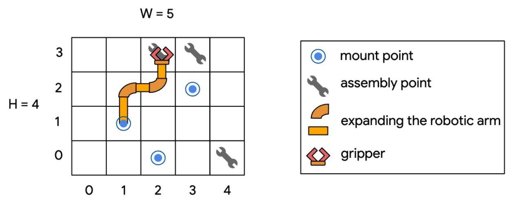
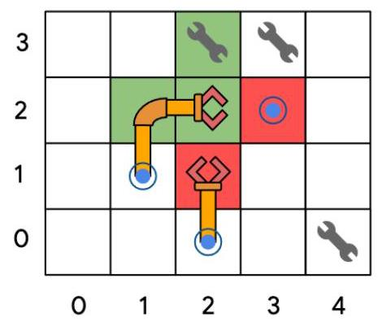
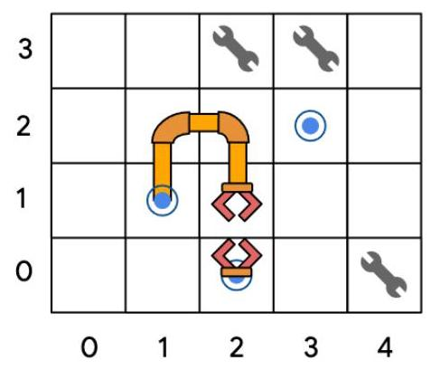
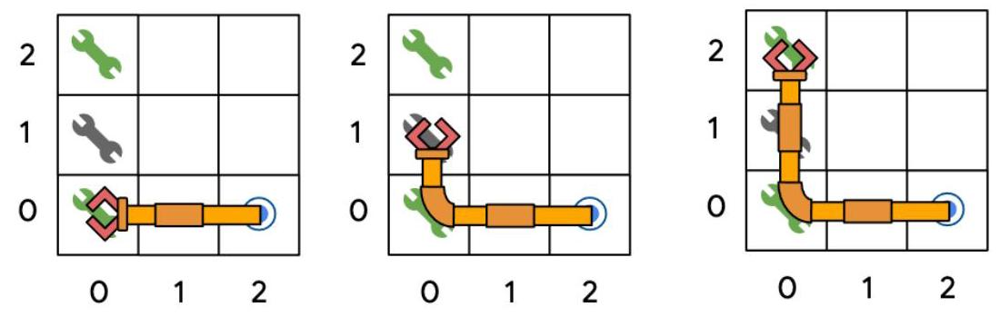
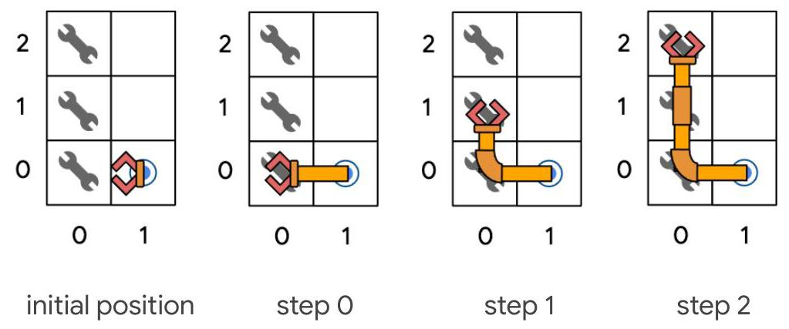
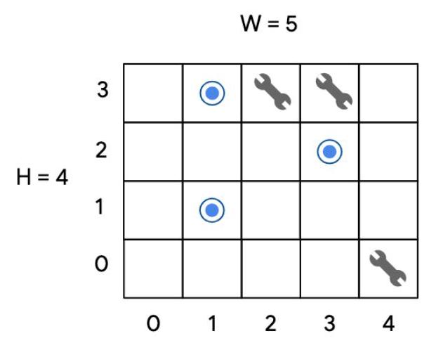
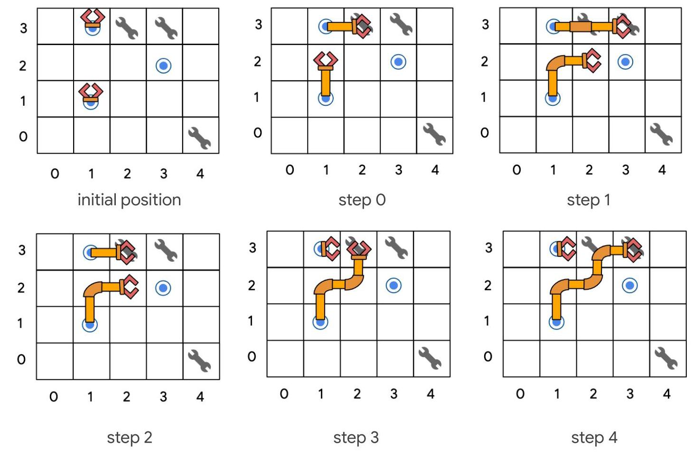

## hash code

# Assembling smartphones

Problem statement for the Final Round of Hash Code 2020

## Introduction

In this problem statement, we will explore the idea of operating an automated assembly line for smartphones.

Building a smartphone is a complex process that involves assembling numerous components, including the screen, multiple cameras, microphones, speakers, a processing unit, and a storage unit.

In order to automate the building of a smartphone, we will be using robotic arms that can move around the assembly workspace performing all necessary tasks.

## Summary

You are given a description of robotic arms and possible mount points, as well as the locations the arms need to visit during the assembly of a smartphone. Create a plan that uses the robotic arms to build a smartphone, completing as many tasks as possible.

## Problem description

## Assembly workspace

The assembly workspace consists of a rectangular grid of cells that has a width of $W$ columns and a height of $\mathbf{H}$ rows (so it contains $\mathbf{W} \times  \mathbf{H}$ cells in total). Some of the cells are mount points for robotic arms or assembly points that need to be visited by a robotic arm.

## Mount points

Mount points are cells that can be used as the initial positions of a robotic arm. At most one robotic arm can be mounted in any single mount point.

## Robotic arms

There are $\mathbf{R}$ robotic arms that can be used for the assembly. Each robotic arm has to be installed at a mount point and is equipped with a gripper. Initially, the gripper of each robotic arm is in the same cell as the mount point of the arm.

Robotic arms can move the gripper and expand to one of the four neighbouring cells (up/down/right/left - not diagonally). Robotic arms can expand as far as needed inside the assembly workspace. Robotic arms can also retract, moving the gripper back into the previous cell occupied by the robotic arm, and toward the direction of the mount point. Robotic arms can also wait in place without moving (for example, waiting to expand until a neighboring cell becomes free).

Robotic arms cannot expand into a cell that is already occupied by a robotic arm (be it a different robotic arm or the same robotic arm) or a mount point, even if there is no arm mounted there. However, an arm can expand to a cell that is currently occupied by the gripper of another robot, if that gripper retracts at the same time. Robotic arms cannot expand outside the grid of the assembly workspace. Robotic arms can expand to any other cell (not occupied by a robotic arm and not containing a mount point), including cells that contain assembly points (visiting assembly points is, indeed, the goal of their movement).

Figure. The robotic arm mounted at $\left\lbrack  {1,1}\right\rbrack$ can stay at its current position $\left\lbrack  {2,2}\right\rbrack$ , retract to [1, 2], or expand upwards [2, 3]: The assembly point at [2, 3] is not blocking it. However, it cannot go down to [2, 1], as this cell is occupied by another robotic arm (assuming the other robotic arm doesn't retract), and it cannot go right [3, 2] as this cell is a mount point.

Figure. However, if the robotic arm mounted at $\left\lbrack  {2,0}\right\rbrack$ retracts, then the one mounted at $\left\lbrack  {1,1}\right\rbrack$ can now expand to position $\left\lbrack  {2,1}\right\rbrack$

## Steps

The entire assembly process proceeds in $L$ steps ("step" here is a unit of time). In each step, each arm can make at most one movement (expanding or retracting the gripper by one cell).

## Assembly points and tasks

You are given a list of $T$ tasks that should be completed by the robotic arms. Each task has a score awarded for completing it. Each task can only be completed once, but you do not need to complete all tasks.

Each task consists of one or more assembly points that need to be visited in the given order by a single robotic arm. The same assembly point may appear in the description of multiple tasks, and may appear multiple times in the description of a single task. An assembly point will never be in the same cell as a mount point.

Each robotic arm can only work on one task at a time (i.e. it cannot start a new task before finishing the current task). If needed, it can still visit assembly points not related to the current task (see the example below).

For example, if there are two tasks:

- task O with 2 assembly points: $\left\lbrack  {0,0}\right\rbrack  ,\left\lbrack  {0,2}\right\rbrack$

- task 1 with 1 assembly point: $\left\lbrack  {0,1}\right\rbrack$

A robotic arm that visits cells $\left\lbrack  {0,0}\right\rbrack  ,\left\lbrack  {0,1}\right\rbrack  ,\left\lbrack  {0,2}\right\rbrack$ to complete task0, still needs to move the gripper back to $\left\lbrack  {0,1}\right\rbrack$ to complete task 1 afterwards, even though this arm visited this cell already while working on task 0 .

Figure. The green assembly points need to be visited for task 0 . Even though the gripper also visits the assembly point at $\left\lbrack  {0,1}\right\rbrack$ , this does not count toward completing task 1, because the arm was working on task 0 when the gripper was in [0, 1].

The work of the gripper in an assembly point doesn't take any additional steps to complete. Note that this also means that if a task's final assembly point is the same as the first assembly point of another task, an arm can work on both tasks while being at that point, during the same step.

For example, with the following tasks:

- task O with 2 assembly points: $\left\lbrack  {0,0}\right\rbrack  ,\left\lbrack  {0,1}\right\rbrack$

- task 1 with 1 assembly point: $\left\lbrack  {0,1}\right\rbrack$

- task 2 with 1 assembly point: $\left\lbrack  {0,1}\right\rbrack$

- task 3 with 2 assembly point: $\left\lbrack  {0,1}\right\rbrack  ,\left\lbrack  {0,2}\right\rbrack$

A single arm mounted at $\left\lbrack  {1,0}\right\rbrack$ can finish all those tasks in 3 steps, first visiting the cell [0,0], then [0,1], then [0,2].

Figure. The arm works on task 0 first. In step 0, the arm moves the gripper from [1, 0] to [0,0], which is the first assembly point needed for task 0 . In step 1, the arm moves the gripper to $\left\lbrack  {0,1}\right\rbrack$ , completing task0. The arm then works on task 1, which is immediately completed because the gripper is already in the cell [0, 1], which is the

only assembly point needed for task 1. The arm then works on task 2, which is similarly immediately completed. Finally the arm then works on task 3 . In step 2, the arm expands to $\left\lbrack  {0,2}\right\rbrack$ and finishes task 3 .

## Input data set

## File format

Each input data set is provided in a plain text file. The file contains only ASCII characters with lines ending with a single '\\n' character (also called "UNIX-style" line endings). When multiple numbers are given in one line, they are separated by a single space between each two numbers.

The first line of the data set contains:

- an integer $W\left( {1 \leq  W \leq  {10}^{3}}\right)$ - the width of the assembly workspace (number of columns),

- an integer $H\left( {1 \leq  H \leq  {10}^{3}}\right)$ - the height of the assembly workspace (number of rows),

- an integer $R\left( {1 \leq  R \leq  {10}^{2}}\right)$ - the number of robotic arms available,

- an integer $\mathbf{M}\left( {\mathbf{R} \leq  \mathbf{M} \leq  {10}^{3}}\right)$ - the number of mount points,

- an integer $T\left( {1 \leq  T \leq  {10}^{3}}\right)$ - the number of tasks available, and

- an integer $L\left( {1 \leq  L \leq  {10}^{4}}\right)$ - the number of total steps for the assembly process.

This is followed by $\mathbf{M}$ lines describing the mount points. Each such line contains integers $\mathbf{x}\left( {0 \leq  \mathbf{x} < \mathbf{W}}\right)$ and $\mathbf{y}\left( {0 \leq  \mathbf{y} < \mathbf{H}}\right)$ describing the coordinates of the mount points. A cell can have at most one mount point.

This is followed by $T$ sections describing the tasks. Each task is described in two lines. The first line describing each task contains:

- an integer $S\left( {1 \leq  S \leq  {10}^{6}}\right)$ - the score awarded for finishing the task,

- an integer $P\left( {1 \leq  P \leq  {10}^{3}}\right)$ - the number of assembly points of this task.

The second line describing the task contains $2 \cdot  P$ integers ${x}_{0},{y}_{0},{x}_{1},{y}_{1},\ldots ,{x}_{P - 1},{y}_{P - 1}$ $\left( {0 \leq  {\mathbf{x}}_{i} < \mathbf{W},0 \leq  {\mathbf{y}}_{i} < \mathbf{H}}\right)$ - the coordinates of the assembly points in order, the first assembly point having the coordinates $\left\lbrack  {{x}_{0},{y}_{0}}\right\rbrack$ and the last assembly point having the coordinates $\left\lbrack  {{\mathbf{x}}_{P - 1},{\mathbf{y}}_{P - 1}}\right\rbrack$ .

## Example

Note that the example input file below contains extra blank lines for clarity, the input files in the Judge System don't contain blank lines.

<table><tr><td>Input file</td><td>Description</td></tr><tr><td>5 4 2 3 3 5</td><td>The workspace is 5 cells wide, 4 cells high, there are 2 arms and 3 mount points, 3 tasks and 5 steps.</td></tr><tr><td>1 1</td><td>Mount point in cell [1, 1].</td></tr><tr><td>1 3</td><td>Mount point in cell [1, 3].</td></tr><tr><td>3 2</td><td>Mount point in cell [3, 2].</td></tr><tr><td>102 $\begin{array}{llll} 2 & 3 & 3 & 3 \end{array}$</td><td>Task 0 is worth 10 score points with 2 assembly points: [2, 3] and [3, 3]</td></tr><tr><td>5 1 4 0</td><td>Task 1 is worth 5 score points with 1 assembly point: [4, 0]</td></tr><tr><td>1 1 3 3</td><td>Task 2 is worth 1 score point with 1 assembly point: $\left\lbrack  {3,3}\right\rbrack$</td></tr></table>

Figure. The example input above corresponds to this configuration of the assembly workspace.

## Submissions

## File format

Your submission describes where the robotic arms are installed and how they are used.

The submission file must start with a line containing the number $\mathbf{A}\left( {0 < \mathbf{A} \leq  \mathbf{R}}\right)$ of robotic arms you want to use.

This is followed by $\mathbf{A}$ sections describing each robotic arm. Each section must consist of three lines. The first line must contain:

- two integers $\mathbf{x}\left( {0 \leq  \mathbf{x} < \mathbf{W}}\right)$ and $\mathbf{y}\left( {0 \leq  \mathbf{y} < \mathbf{H}}\right)$ describing the coordinates of the mount point where the robotic arm is installed,

- an integer $Z\left( {1 \leq  Z \leq  T}\right)$ - the number of tasks the robotic arm completes, and

- an integer $\mathbf{K}\left( {1 \leq  \mathbf{K} \leq  L}\right)$ - the number of instructions for the robotic arm.

The second line must contain $Z$ 0-based indices of tasks the robotic arm should work on. The tasks must be given in the order the robotic arm works on them. (The robotic arm needs to visit all assembly points of the first task, then the second task, and so on in that order.)

The third line must contain $K$ space-separated instructions for the robotic arms. The following instructions are available:

- R - move the gripper one cell right, i.e. increasing the column by 1 ,

- L - move the gripper one cell left, i.e. decreasing the column by 1 ,

- U - move the gripper one cell up, i.e. increasing the row by 1 ,

- D - move the gripper one cell down, i.e. decreasing the row by 1 , and

- W - wait for one step.

Note that each robotic arm has to be installed at a mount point and no two robotic arms can be installed at the same mount point. No two robotic arms can work on the same task.

Example

Note that the example file below contains extra blank lines for clarity, the submission files sent to the Judge System cannot contain blank lines.

<table><tr><td>Submission file Right; visiting cells: [1, 2], [2, 2], [2, 2], [2, 3], [3, 3]</td><td>Description</td></tr><tr><td>2</td><td>2 robotic arms are used</td></tr><tr><td>1 1 1 5 0 U R W U R</td><td>arm mounted at $\left\lbrack  {1,1}\right\rbrack$ working on 1 task with 5 commands the arm only works on task O the arm gripper moves Up, Right, Waits, and then moves Up,</td></tr><tr><td>$\begin{array}{llll} 1 & 3 & 1 & 4 \end{array}$</td><td>arm mounted at $\left\lbrack  {1,3}\right\rbrack$ working on 1 task with 4 commands</td></tr><tr><td>2 R R L L</td><td>the arm only works on task 2 the arm gripper moves Right, Right and contracts by going Left, Left visiting cells [2, 3], [3, 3], [2, 3], [1, 3]</td></tr></table>

## Scoring

Your score is the sum of all scores of the tasks finished.

In order for your submission to be valid, you must ensure that:

- the arms are never instructed to expand beyond the workspace, to a mount point (regardless of whether any arm is mounted there - but note that an arm is always allowed to retract to its own mount point) or to a cell occupied in the same step by some robotic arm, and

- each task is assigned to at most one arm, and

- each arm completes all tasks assigned to it.

Note that the robotic arms can be in any configuration after finishing a task and don't need to be retracted to the initial position. You don't need to finish all tasks to receive points for your submission.

In the example submission, the robotic arm mounted at $\left\lbrack  {1,1}\right\rbrack$ completes task 0 which awards a score of 10 and the arm mounted at $\left\lbrack  {1,3}\right\rbrack$ completes task 2 which awards a score of 1. Thus, the total score of the submission is 11.

Note that there are multiple data sets representing separate instances of the problem. The final score for your team will be the sum of your best scores for the individual data sets.