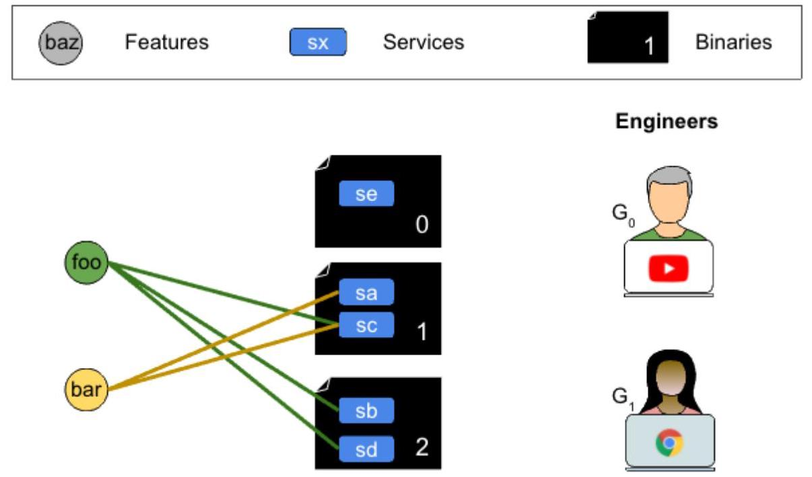
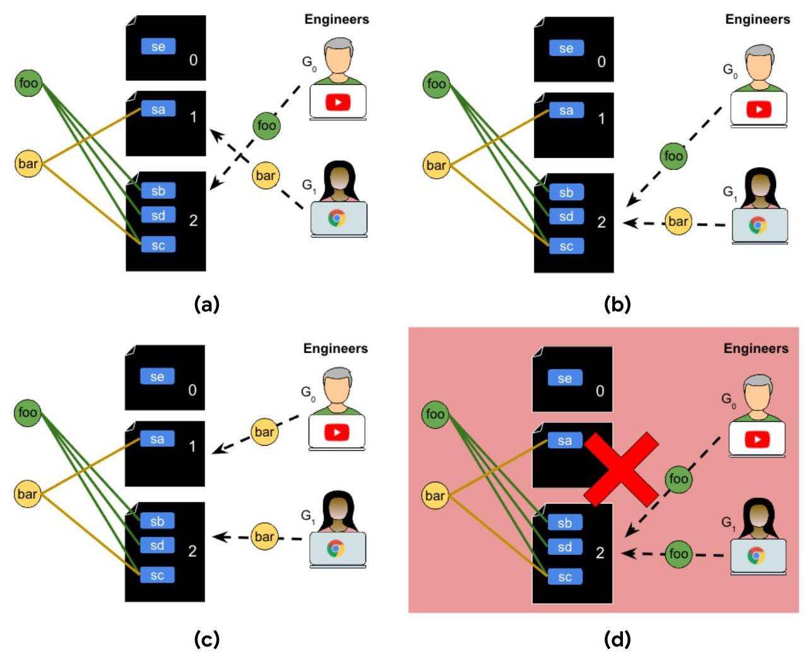
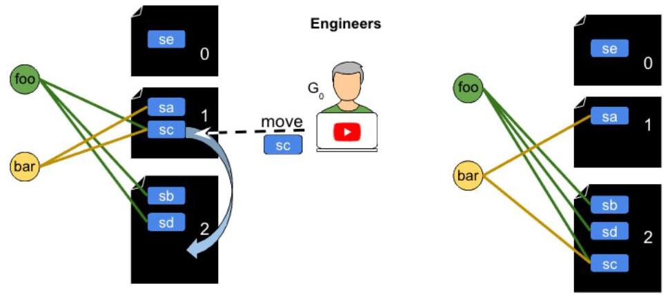
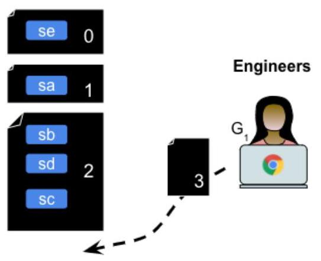
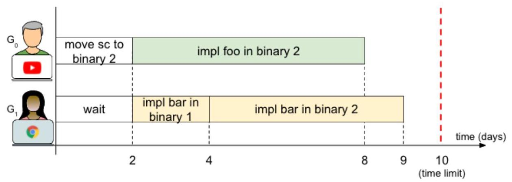
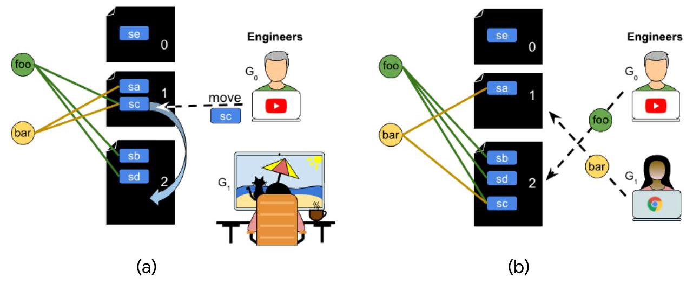
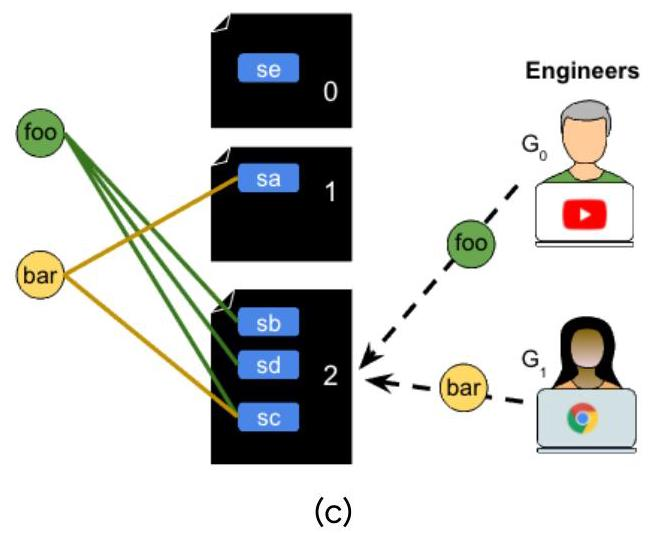

# hash code

Software engineering at scale

Problem statement for the World Finals of Hash Code 2021

## Introduction

Google stores the vast majority of its code in one monolithic codebase, holding billions of lines of code. As of 2016, more than 25,000 software engineers were contributing to it ${}^{1}$ , improving existing services and adding cool new features to meet the demands of their users.

With the growing size of the codebase and the increasing number of Google software engineers, it is getting challenging to schedule the engineers' work, so they can be productive and launch features that make users happy.

## Goal

Given a number of services, a number of binaries, and a set of features to implement, decide how engineers should schedule their work to deliver features that would delight the users as much as possible.

## Problem description

## Architecture

In this problem, we consider features, services and binaries:

- Features are the user-facing functionality of Google products. For example: video playlists in YouTube or weather forecasts in Google Search.

- Services are programs running in Google data centers. For example: YouTube may have a service responsible for storing user video collections.

- Binaries are groups of services which are combined to run together for efficiency. For example: services running in the same binary can share resources such as a database connection.

---

${}^{1}$ https://dl.acm.org/doi/10.1145/2854146

---

## Features

Each feature is described by:

- The services it relies on.

- The number of daily users that benefit from the feature (when it's launched).

Once a feature is implemented in all services that it relies on, it is immediately launched and users start to benefit from it.

## Services and binaries

Each service is part of exactly one binary, but one binary can contain multiple services ${}^{2}$ . Services can be moved between binaries and new binaries can be created as needed.

When implementing a feature, the engineers take advantage of the fact that a binary contains multiple services - an engineer can implement a given feature in all relevant services in a given binary at once.

Figure 1. There are two features (foo and bar), five services (sa, sb, sc, sd, se), three binaries(0,1and 2), and 2 engineers $\left( {G}_{0}\right.$ and $\left. {G}_{1}\right)$ . Binary 0 runs one service (se), binary 1 runs two (sa and sc) and binary 2 also runs two (sb and sd). To implement feature foo engineers need to work on services sb, sc, and sd, which means that they will need to work on two binaries (1 and 2). To implement feature bar, engineers need to work on features sa and sc, thus only binary 1 .

---

${}^{2}$ Initially each binary contains at least one service, but it is valid for binaries to become empty later on.

---

## Scheduling work

Your goal is to assign work to engineers to implement features so that as many users as possible benefit from them.

Google has G engineers who can implement the features. On each day an engineer can start any of the following tasks:

- Implement a feature ${F}_{i}$ in the services of binary ${B}_{j}$ .

- Move service ${S}_{i}$ from binary ${B}_{j}$ to another binary ${B}_{k}$ .

- Create a new empty binary.

- Wait for a number of days.

None of these tasks can be interrupted, meaning that once an engineer starts working on a task, they will continue to do so for the duration of that task.

Making changes to a set of services that are running in one binary is easier than making changes to services that are scattered across multiple binaries. On the other hand, many engineers working on services in one binary get in each other's way, slowing down the work. This is described in more detail below.

## Task: Implement a feature

An engineer can choose any binary ${B}_{j}$ and implement a feature ${F}_{i}$ in all relevant services in that binary at once.

If an engineer works on a binary ${B}_{j}$ to implement a feature ${F}_{i}$ , this work will require ${D}_{Fi} + {R}_{Bj} + {C}_{Bj}$ days, where:

- ${D}_{Fi}$ is the difficulty of feature ${F}_{i}$ ,

- ${R}_{Bj}$ is the total number of services in ${B}_{j}$ (including services not relevant to ${F}_{i}$ ), and

- ${C}_{Bj}$ is the number of engineers already working on features in ${B}_{j}$ on the first day of this work.

Once the task is done, feature ${F}_{i}$ is implemented in all relevant services in ${B}_{j}$ .

Multiple engineers can implement the same feature in different binaries, but only one engineer at a time can implement a specific feature in one binary. If two engineers start working on the same binary (implementing two different features) on the same day, the one listed earlier in the submission file is the first to start and counts towards the number of engineers working on the binary for the second one.

Figure 2. (a) Engineer ${G}_{0}$ works on binary 2 to implement feature foo. In this case, ${\mathrm{R}}_{\mathrm{B}2} = 3$ as there are three services (sb, sc and sd) in binary 2, and ${\mathrm{C}}_{\mathrm{B}2} = 0$ , as no other engineer is working on that binary that day. In total, the engineer needs ${\mathrm{D}}_{\text{foo }} + 3 + 0$ days of work in binary 2 for feature foo. Similarly, engineer ${G}_{1}$ needs ${D}_{\text{bar }} + 1 + 0$ , where 1 is the number of services in binary 1 (service sa).

(b) Both engineers work on binary 2 implementing different features. Supposing that engineer ${G}_{0}$ starts first on this binary, ${G}_{0}$ needs ${D}_{\text{foo }} + 3 + 0$ days: since no-one was working on binary $2,{\mathrm{C}}_{\mathrm{B}2} = 0$ . Engineer ${\mathrm{G}}_{1}$ needs ${\mathrm{D}}_{\text{bar }} + 3 + 1$ days.

(c) It is possible for two engineers to work on the same feature (here feature bar), but only if they work in two different binaries.

(d) It is not allowed for two engineers to work on the same feature on the same binary.

## Task: Move a service

An engineer can move a service ${S}_{i}$ from one binary ${B}_{j}$ to a different binary ${B}_{k}$ . After the move, all features that needed service ${S}_{i}$ will need to have engineers working on binary ${B}_{k}$ instead of ${B}_{j}$ . Features already implemented in service ${S}_{i}$ remain implemented.

It takes $\max \left( {{R}_{Bj},{R}_{Bk}}\right)$ days to move service ${S}_{i}$ from binary ${B}_{j}$ to ${B}_{k}$ , where ${R}_{Bj}$ and ${R}_{Bk}$ are the number of services running in binaries ${B}_{j}$ and ${B}_{k}$ respectively, before the move.

No other engineer can start working on binaries ${B}_{j}$ and ${B}_{k}$ until the move is finished and the move can't start if any engineer is working on either binary at the time (implementing a feature or moving a service to/from one of these binaries).

Figure 3. Engineer ${G}_{0}$ moves service sc from binary 1 to binary 2. Observe that this affects both features (foo and bar).

Task: Create a new binary An engineer can spend $\mathrm{N}$ days to create a new empty binary. Its ID is the minimum positive integer that is not used yet.

Figure 4. Engineer ${G}_{1}$ creates a new empty binary (binary 3).

Task: Wait

Figure 5. An engineer takes a break and waits, for example watching cat videos.

An engineer can wait for a number of days.

## Input data set

## File format

Each input data set is provided in a plain text file. The file contains only ASCII characters with lines ending with a single '\\n' character (also called "UNIX-style" line endings). When multiple numbers or strings are given in one line, they are separated by a single space between each two elements.

- The first line:

- time limit in days: $L\left( {1 \leq  L \leq  {10}^{3}}\right)$ ,

- number of Google engineers $G\left( {1 \leq  G \leq  {10}^{5}}\right)$ ,

- number of services $S\left( {1 \leq  S \leq  {10}^{4}}\right)$ ,

- number of initial binaries $\mathrm{B}\left( {1 \leq  \mathrm{B} \leq  {10}^{4}}\right)$ ,

- number of features $F\left( {1 \leq  F \leq  {10}^{4}}\right)$ ,

- duration in days to create a new binary $\mathrm{N}\left( {1 \leq  \mathrm{N} \leq  {10}}\right)$ .

- The next S lines describe the services and each of these contains:

- the service name (string of 1-20 lowercase letters a-z and hyphens -),

- an integer ${B}_{i}\left( {0 \leq  {B}_{i} \leq  B - 1}\right)$ - the ID of the binary where the service initially runs. Binaries are numbered from 0 to B-1.

- The next F blocks of lines describe the features. On each block:

- The first line contains:

the feature name (string of 1-20 lowercase letters a-z and hyphens -),

${M}_{i}\left( {1 \leq  {M}_{i} \leq  S}\right)$ - the number of services that need to be modified to support the $i$ -th feature,

${D}_{i}\left( {1 \leq  {D}_{i} \leq  {10}^{2}}\right)$ - the difficulty of the $i$ -th feature,

${\mathrm{U}}_{\mathrm{i}}\left( {1 \leq  {\mathrm{U}}_{\mathrm{i}} \leq  {10}^{5}}\right)$ - number of daily users that will benefit from the feature once it is launched.

- The second line contains a list of strings ${S}_{i,1},{S}_{i,2},\ldots ,{S}_{i,{Mi}}$ - the names of the services to be modified to support the i-th feature.

## Example

The following example input dataset matches the one shown in Figure 1.

<table><tr><td>10 2 5 3 2 5</td><td>10 days, 2 engineers, 5 services, 3 binaries and 2 features, we need 5 days to create a new binary.</td></tr><tr><td>sa 1</td><td>The first service is named 'sa' and runs in binary 1</td></tr><tr><td>sb 2</td><td>The second service is named 'sb' and runs in binary 2</td></tr><tr><td>SC 1</td><td>The third service is named 'sc' and runs in binary 1</td></tr><tr><td>sd 2</td><td>The fourth service is named 'sd' and runs in binary 2</td></tr><tr><td>se 0</td><td>The fifth service is named 'se' and runs in binary 0</td></tr><tr><td>foo 3 3 100</td><td>foo feature is implemented in 3 services, its difficulty is 3 and 100 users per day will benefit from it</td></tr><tr><td>sc sb sd</td><td>foo feature is implemented in services sc, sb and sd</td></tr><tr><td>bar 2 1 20</td><td>bar feature is implemented in 2 services, its difficulty is 1 and 20 users per day will benefit from it</td></tr><tr><td>sc sa</td><td>bar feature is implemented in services sc and sa</td></tr></table>

Note that the input file does not contain any blank lines. Blank lines and line wrapping in the example above are added for clarity.

## Submissions

Your submission describes the schedule of the engineers' work.

## File format

- The first line: $\mathrm{E}$ - the number of engineers that we plan the work for $\left( {0 \leq  \mathrm{E} \leq  \mathrm{G}}\right)$

- The next E blocks:

- The first line: $T\left( {1 \leq  T \leq  L}\right)$ - number of tasks for the given engineer.

- The next T lines contain one of:

- Literal impl followed by a feature name ${F}_{i}$ and a number ${B}_{j}$ - the engineer should implement the feature named ${F}_{i}$ in the binary with ID ${B}_{j}$ .

- Literal move followed by service name ${S}_{i}$ and a number ${B}_{j}$ - the engineer should move service ${S}_{i}$ from binary ${B}_{k}$ (in which ${S}_{i}$ resides at the time of the move) to a different binary ${B}_{j}$ .

Literal new - the engineer should start a new (empty) binary.

Literal wait followed by number $\mathrm{W}\left( {1 \leq  \mathrm{W} \leq  \mathrm{L}}\right)$ - the engineer should wait for $W$ days.

## Example

---

	<table><tr><td>2</td><td>Both engineers will work</td></tr><tr><td>2</td><td>The first engineer will do 2 tasks</td></tr><tr><td>move sc 2</td><td>Move service sc to binary 2</td></tr><tr><td>impl foo 2</td><td>Implement feature foo in binary 2</td></tr><tr><td>3</td><td>The second engineer will do 3 tasks</td></tr><tr><td>wait 2</td><td>Wait for 2 days</td></tr><tr><td>impl bar 1</td><td>Implement feature bar in binary 1</td></tr><tr><td>impl bar 2</td><td>Implement feature bar in binary 2</td></tr></table>

---

Figure 6. The timeline of the engineers' work.

For engineer ${G}_{0}$ , moving cs from binary 1, where it is initially, to binary 2 will need $\max \left( {{R}_{B1},{R}_{B2}}\right)$ , so 2 days. Implementing foo in binary 2 will require 6 days: ${D}_{foo} + {R}_{B2} +$ ${\mathrm{C}}_{\mathrm{B}2}$ , where ${\mathrm{D}}_{\text{foo }} = 3,{\mathrm{R}}_{\mathrm{B}2} = 3$ and ${\mathrm{C}}_{\mathrm{B}2} = 0$ . Similarly, for engineer ${\mathrm{G}}_{1}$ we can calculate the days required to implement each of the binaries for the feature bar.

Figure 7. The work of each engineer at every given time: (a) between days 0 and 2, (b) between days 2 and 4 , (c) between days 4 and 8 . After day 8, feature foo goes live, and stays live until the time limit (day 10), thus for 2 days. Feature bar goes live after day 9 , and thus stays live for 1 day.

## Scoring

The engineers execute the scheduled tasks, one immediately after another, according to the submission file. If an engineer is scheduled to do a task but they can't (e.g. they cannot move a service because another engineer is still working on the same binary), the solution is considered invalid and gets 0 points.

It is valid for an engineer to finish their tasks before the time limit. It is also valid to schedule tasks that will start or finish after the time limit (such tasks are ignored).

Once a feature is implemented in all relevant services before the time limit, it is immediately launched and the users start to benefit from it. It is valid to only partially implement a feature (e.g. if the engineer working on it would finish after the time limit or not even start implementing the feature in some binaries), but it won't earn any points. Likewise, features that get fully implemented after the time limit are allowed but won't earn any points.

# Each feature launched before the time limit scores a number of points equal to

$$
{\mathrm{U}}_{\mathrm{i}} \times  \max \left( {\theta ,\mathrm{L} - {\mathrm{I}}_{\mathrm{i}}}\right)
$$

where

- ${U}_{i}$ - number of users that benefit from the $i$ -th feature

- L - time limit in days

- ${I}_{i}$ - the day when the $i$ -th feature was launched (number of days it took to fully implement i-th feature).

The total score is a sum of the scores earned by each launched feature.

## Example

For instance, in the example above, the first engineer will spend two days to move service sc from binary 1 to binary 2 : initially there are 2 services in binary 1, and 2 services in binary2, so $\max \left( {2,2}\right)  = 2$ . The first engineer will then spend6days $(3 + 3$ +0 ) to implement feature foo there. So foo will be ready on day 8 , meaning it will be live for two days (until day 10, which is the time limit), scoring 200 ( $= 2$ days $\times  {100}$ users) points.

The second engineer will spend 2 days waiting and then 2 days $\left( {1 + 1 + 0}\right)$ implementing feature bar in binary 1. They will then spend 5 days $\left( {1 + 3 + 1}\right)$ implementing feature bar in binary 2. The feature will be live for 1 day, scoring 20 points. The final score is ${220}\left( {{200} + {20}}\right)$ points.

Note that there are multiple data sets representing separate instances of the problem. The final score for your team will be the sum of your best scores for the individual data sets.