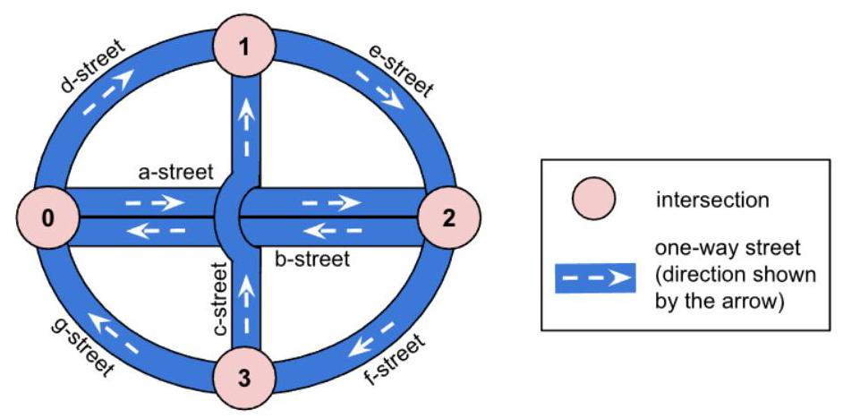
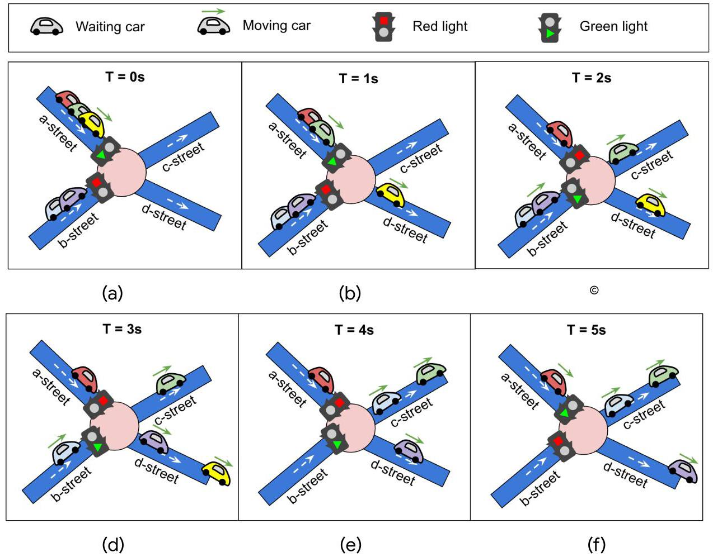
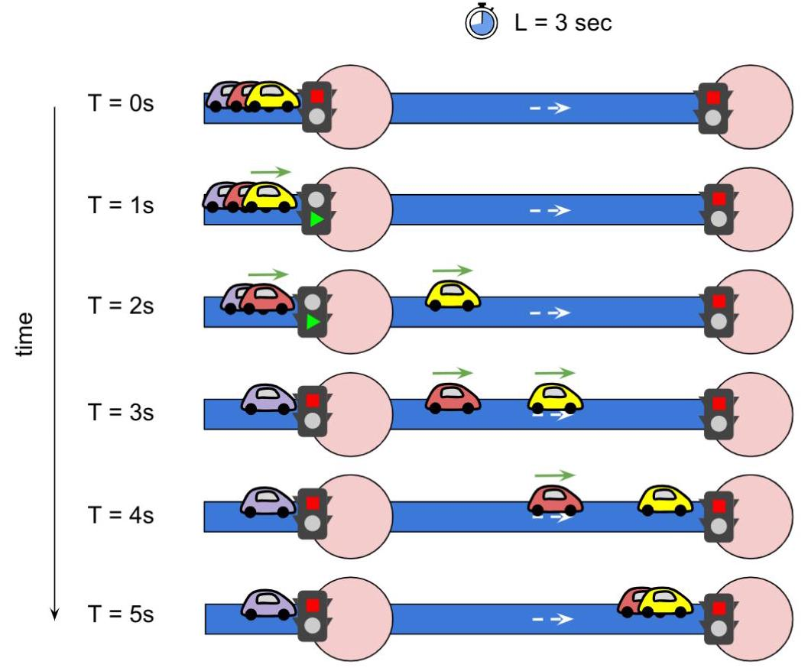
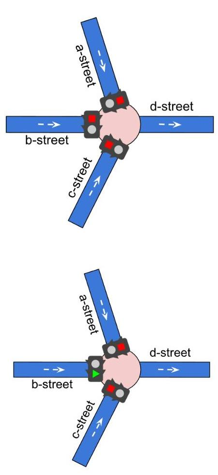
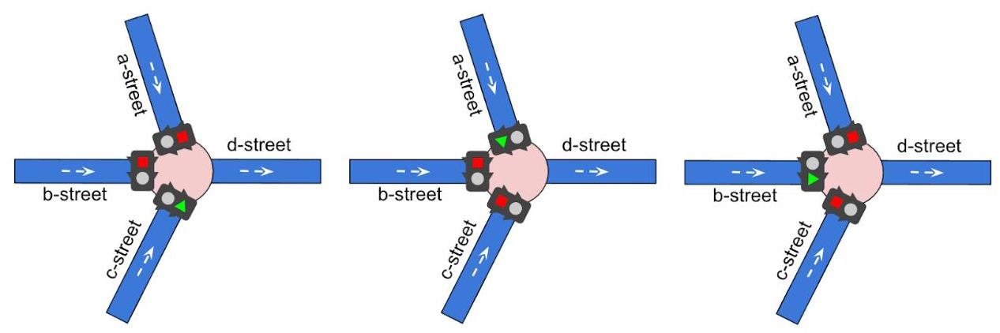
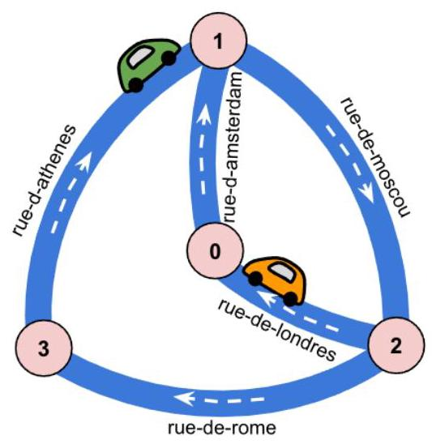

# Hash Code

Traffic signaling

Problem statement for the Online Qualifications of Hash Code 2021

## Introduction

The world's first traffic light dates back to 1868. It was installed in London to control traffic for... horse-drawn vehicles! Today, traffic lights can be found at street intersections in almost every city in the world, making it safer for vehicles to go through them.

Traffic lights have at least two states, and use one color (usually red) to signal "stop", and another (usually green) to signal that cars can proceed through. The very first traffic lights were manually controlled. Nowadays they are automatic, meaning that they have to be carefully designed and timed in order to optimize the overall travel time for all the participants in traffic.

## Task

Given the description of a city plan and planned paths for all cars in that city, optimize the schedule of traffic lights to minimize the total amount of time spent in traffic, and help as many cars as possible reach their destination before a given deadline.

## Problem description

## City plan

The city plan consists of one-way streets and intersections. Each street:

- is identified by a unique name

- leads from one intersection to another

- does not contain any intersections in between (if two streets need to cross outside an intersection, a bridge or tunnel is used)

- has a fixed amount of time $\mathrm{L}$ it takes a car to get from the beginning of the street to the end. If it takes L seconds to drive through a street and a car enters it at time $\mathrm{T}$ it will arrive at the end of the street precisely at $\mathrm{T} + \mathrm{L}$ , independently of how many cars are on the street.

Figure 1. A city plan with 4 intersections(0,1,2and 3)and 7 streets $(a, b$ , ...g-street). Intersections 0 and 2 are directly connected both ways through a-street and b-street. c-street uses a bridge over a-street and b-street and does not intersect with those two streets.

Note that while the streets are one-way, it is still possible to have two one-way streets connecting two intersections in opposite directions (see intersections 0 and 2 and a-street and b-street in Figure 1). However, there will never be two streets connecting two intersections in the same direction.

Each intersection:

- is identified by a unique ID

- has at least one street that comes into it, and one coming out of it

- there is no delay while a car passes through an intersection

For example, in the figure above, if for d-street $L = {4s}$ , and for e-street $L = {3s}$ , a car that moves from intersection 0 to 1 and then 2 , will need exactly 7 (4+3) seconds.

## Traffic lights

There is a traffic light at the end of every street (just before the intersection). Each traffic light has two states: a green light indicates that the cars from that street can cross the intersection and head towards any other street, while a red light indicates that the cars from that street need to stop. At most one traffic light will be green at each intersection at any given time.

For each intersection we can set a traffic light schedule. The traffic light schedule determines the order and duration of green light for the incoming streets of the intersection. The schedule is a list of pairs (incoming street, duration). For a schedule $\left( {{S}_{1}{T}_{1},{S}_{2}{T}_{2},\ldots ,{S}_{k}{T}_{k}}\right)$ the traffic light for the street ${S}_{1}$ will be green for ${T}_{1}$ seconds. During that time only the cars from street ${\mathbf{S}}_{1}$ will be allowed to enter the intersection (and move to any street that starts at this intersection), all other cars have to wait. Then for ${T}_{2}$ seconds only cars from street ${S}_{2}$ will be allowed to enter, and so on, until street ${\mathbf{S}}_{k}$ , after which the process starts over. The schedule can ignore some of the incoming streets - those will never get green light.

When the light at the end of a street is red, arriving cars queue up waiting for the light to turn green. When the light is green, one car can cross the intersection every second. This means that if a green light for a given street lasts for ${T}_{i}$ seconds then only the first ${T}_{i}$ cars from that street will continue their travel (see Figure 2). Others will need to wait for the following green light.

Figure 2. There are two traffic lights, one at the end of a-street with ${T}_{1} = {2s}$ and one at the end of the b-street with ${T}_{2} = {3s}$ . (a) Initially, the traffic light of a-street is green, and the yellow car starts moving. (b) At $\mathrm{T} = 1\mathrm{\;s}$ the next car from a-street starts moving. (c) At $\mathrm{T} = 2\mathrm{\;s}$ a-street has a red light, and the last car waiting there needs to stop. At the same time, the traffic light of b-street turns green, and the first car queued there starts moving. (d), (e) At $\mathrm{T} = 3\mathrm{\;s}$ and $\mathrm{T} = 4\mathrm{\;s}$ , the two cars that were initially on $\mathrm{b}$ -street have already passed the traffic light and continued their path. (f) At $\mathrm{T} = 5\mathrm{\;s}$ the light at a -street turns back to green and the car that was waiting there can now move.

The traffic light schedule is controlled by your submissions. You don't have to specify the schedule of all traffic lights, but by default all lights on all intersections are red (yes, cars stuck there will have to wait until the end of simulation).

## Cars

Each car is described by a sequence of streets (path) it is going to drive through. The paths are defined by the input datasets and can't be altered. In the input datasets we guarantee that each car can go through a single intersection at most once.

Initially all cars start at the end of the first street in their path, waiting for the green light (in case the traffic light is red), or ready to move (if it's green). If two cars start at the end of the same street, the car listed first in the input file goes first. Each car then follows a given path, while obeying the traffic lights, and needs to reach the end of the last street in that path.

Cars are queued up at the end of each street: The first car in the queue can cross the intersection immediately after the light turns green. Cars after that, cross the intersection one after another, one car every second.

Figure 3. This figure shows the state of three cars at exactly $\mathrm{T}$ seconds, with the simulation starting at T=0s and ending at T=5s. The street has L=3s, meaning that any car needs 3 seconds to go from its beginning to the end. The light turns green on the left intersection at T=1s and turns red again 2 seconds later. The cars are queuing up at the end of the street, with yellow being the first one. At T=1s the yellow car immediately starts moving and reaches the end of the street 3 seconds later, at T=4s. The red car has to wait 1 second before it starts moving and arrives at the end of the street 3 seconds later, at T=5s. The purple car did not have enough time to enter the street, as the light already turned red. Note that this figure only shows two streets for simplicity: when a traffic light is shown to be red, this means that another one in the same intersection has turned green.

When a car enters the last street of its path, it completes its drive until the end of the street and then is immediately removed from it. This means that the car does not queue up at the end of the last street of its path and does not enter the intersection at the end of it.

## Example traffic light schedules

In the following example, an intersection has 3 streets leading to it (a, b and c-street), and one leaving the intersection (d-street). We consider three different example schedules for these traffic lights:

## No traffic light schedule (default)

Figure 4 (a). If no traffic light schedule is set for an intersection, all of the traffic lights remain red throughout the simulation. Any cars that are scheduled to pass through a, b or c-street will be blocked and not reach their destination.

Schedule that covers only one street

Figure 4 (b). In this example the traffic light schedule covers only one incoming street (b-street). In this case b-street always has a green light. Any cars coming from b-street will always go through the intersection directly, while any cars scheduled to pass through either a-street or c-street will be blocked and not reach their destination.

Schedule that covers all streets

Figure 4 (c). In this example, the traffic light schedule covers all incoming streets (c-street, then a-street, then b-street). For each street we can define a different ${T}_{i}$ , meaning different duration during which that traffic light remains green.

## Input data set

## File format

Each input data set is provided in a plain text file. The file contains only ASCII characters with lines ending with a single "in' character (also called "UNIX-style" line endings). When multiple numbers are given in one line, they are separated by a single space between each two numbers.

- The first line contains five numbers:

- an integer $\mathrm{D}\left( {1 \leq  \mathrm{D} \leq  {10}^{4}}\right)$ - the duration of the simulation, in seconds,

- an integer $\mathbf{I}\left( {2 \leq  \mathbf{I} \leq  {10}^{5}}\right)$ - the number of intersections (with IDs from 0 to I-1),

- an integer $\mathbf{S}\left( {2 \leq  \mathbf{S} \leq  {10}^{5}}\right)$ - the number of streets,

- an integer $\mathbf{V}\left( {1 \leq  \mathbf{V} \leq  {10}^{3}}\right)$ - the number of cars,

- an integer $\mathbf{F}\left( {1 \leq  \mathbf{F} \leq  {10}^{3}}\right)$ - the bonus points for each car that reaches its destination before time D.

- The next S lines contain descriptions of streets. Each line contains

- two integers $\mathbf{B}$ and $\mathbf{E}\left( {\theta  \leq  \mathbf{B} < \mathbf{I},\theta  \leq  \mathbf{E} < \mathbf{I}}\right)$ denoting the intersection where the street begins and ends,

- the street name (a string consisting of between 3 and 30 lowercase characters a-z and the character -) and

- an integer $L\left( {1 \leq  L \leq  D}\right)$ - the time it takes to get from the beginning to the end.

- The next $\mathbf{v}$ lines describe the paths of each car. Each line contains:

- an integer $\mathbf{P}\left( {2 \leq  \mathbf{P} \leq  {10}^{3}}\right)$ - the number of streets that the car wants to travel,

- followed by $\mathbf{P}$ names of the streets: The car starts at the end of the first street (i.e. it waits for the green light to move to the next street) and follows the path until the end of the last street. The path of a car is always valid, i.e. the streets will be connected by intersections (in the right direction).

## Example

<table><tr><td>6 4 5 2 1000</td><td>The simulation lasts 6 seconds, there are 4 intersections, 5 streets, and 2 cars; and a car scores 1000 points for reaching the destination on time.</td></tr><tr><td>2 0 rue-de-londres 1</td><td>Street rue-de-londres starts at intersection 2, ends at $\theta$ , and it takes $L = 1$ seconds to go from the beginning to the end.</td></tr><tr><td>0 1 rue-d-amsterdam 1</td><td>Street rue-d-amsterdam starts at intersection 0, ends at 1 and has L=1.</td></tr><tr><td>3 1 rue-d-athenes 1</td><td>Street rue-d-athenes starts at intersection 3, ends at1and has $L = 1$ .</td></tr><tr><td>2 3 rue-de-rome 2</td><td>Street rue-de-rome starts at intersection 2, ends at 3 and has L=2.</td></tr><tr><td>1 2 rue-de-moscou 3</td><td>Street rue-de-moscou starts at intersection 1, ends at 2, and has L=3.</td></tr><tr><td>4 rue-de-londres rue-d-amsterdam rue-de-moscou rue-de-rome</td><td>The first car starts at the end of rue-de-londres and then follows the given path.</td></tr><tr><td>3 rue-d-athenes rue-de-moscou rue-de-londres</td><td>The second car starts at the end of rue-d-athenes and then follows the given path.</td></tr></table>

Note that the input file does not contain any blank lines. Blank lines in the example above are added for alignment with the explanations.

Figure 4. The streets and intersections, as given by the example input data set, as well as the two cars at their initial positions.

## Submissions

Your submission describes the traffic light schedules you want to set for specific intersections.

## File format

The first line must contain a single integer $\mathbf{A}\left( {0 \leq  \mathbf{A} \leq  \mathbf{I}}\right)$ , the number of intersections for which you specify the schedule.

Then, the submission file must describe the intersection schedules, in any order. Each schedule must be described by multiple lines:

- the first line containing a single integer i $\left( {0 \leq  i < I}\right)$ - the ID of the intersection.

- the second line containing a single integer ${E}_{i}\left( {\theta  < {E}_{i}}\right)$ - the number of incoming streets (of the intersection i) covered by this schedule

- ${E}_{i}$ lines describing the order and duration of green lights. Each of those lines must contain (separated by a single space):

- the street name

- an integer $T\left( {1 \leq  T \leq  D}\right)$ - how long each street should have a green light.

Each intersection can only be listed once in the submission file. And each street name can only be listed once per schedule. If the street name is not present in intersection configuration it means its traffic light is always red. If an intersection configuration is not present in the submission file all of its traffic lights are always red.

## Example

<table><tr><td>3 1 2 rue-d-athenes 2 rue-d-amsterdam 1 0 1 rue-de-londres 2 2 1 rue-de-moscou 1</td><td>There are 3 intersections with traffic light schedules: On intersection 1 the traffic lights are green for 2 different incoming streets, namely rue-d-athenes for 2 seconds, then green for rue-d-amsterdam for 1 second, then again rue-d-athenes. On intersection 0 the traffic lights are green for 1 incoming street only, namely rue-de-londres for 2 seconds per cycle (it's always green for rue-de-londres) On intersection 2 the traffic lights are green for 1 incoming street only, namely rue-de-moscou for 1 second per cycle (it's always green for rue-de-moscou).</td></tr></table>

## Scoring

The score awarded for each car that finishes its path before the end of the simulation. For a car that finishes its path at time T, the awarded score is (F) points (fixed award for finishing the path) and additionally (D-T): one point for each second left when the car finished the path.

In other words: if a car finishes at time $T$ it scores

- F + (D - T) points if $T \leq  D$

- or 0 points otherwise.

The score for the solution is the sum of scores for all cars.

## Example

For instance, in the example above, the first car:

- T = 0s: crosses immediately intersection 0 , as the traffic light there is always green

- T = 1s: one second later, it has gone through rue-d-amsterdam. However, the traffic light is red (as for intersection 1, the submission has set the duration for rue-d-athenes's light to be green for 2 seconds).

- $\mathrm{T} = 2\mathrm{\;s}$ : the car now crosses the intersection and continues to rue-de-moscou

- T = 5s: the car has reached the end of rue-de-moscou, finds a green light at intersection 2, crosses it and continues to rue-de-rome.

This first car would have reached the end of rue-de-rome at $\mathrm{T} = 7\mathrm{\;s}$ , but this is past the deadline of the run (defined in the input data set). Meaning that0points are assigned to this car.

The second car:

- T = 0s: finds a green light at intersection 1 and continues to rue-de-moscou.

- T = 3s: reaches the end of rue-de-moscou, finds a green light at intersection

2 and no cars waiting, so it immediately crosses the intersection and heads towards rue-de-londres.

- T= 4s: the car reaches the end of rue-de-londres, which is its destination.

So the second car finishes before the deadline, and gets a score of ${1000} + \left( {6 - 4}\right)  =$ 1002 points.

The final score for this submission is 1002.

Note that there are multiple data sets representing separate instances of the problem. The final score for your team will be the sum of your best scores for the individual data sets.