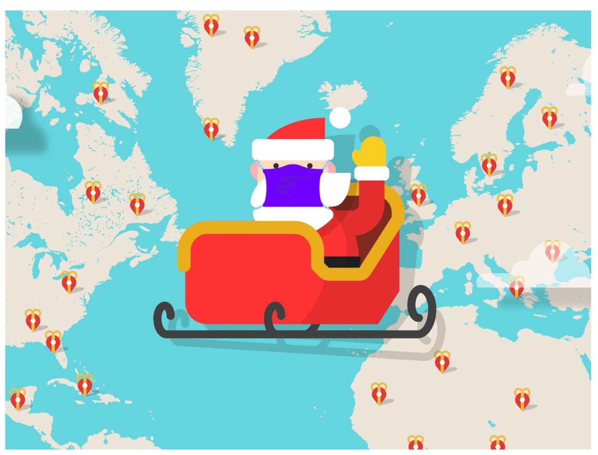
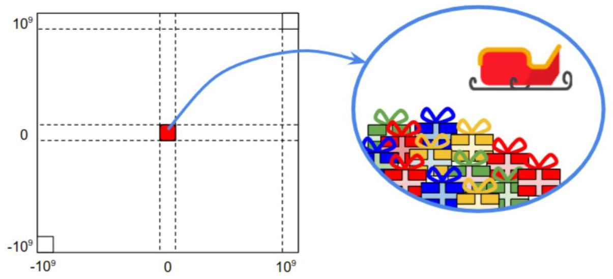
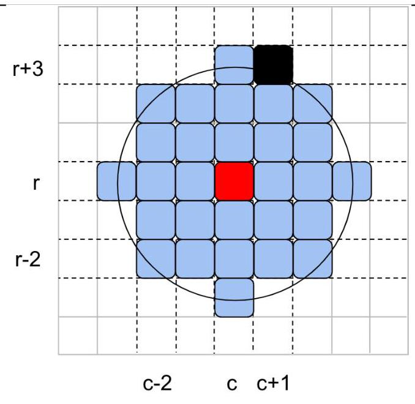
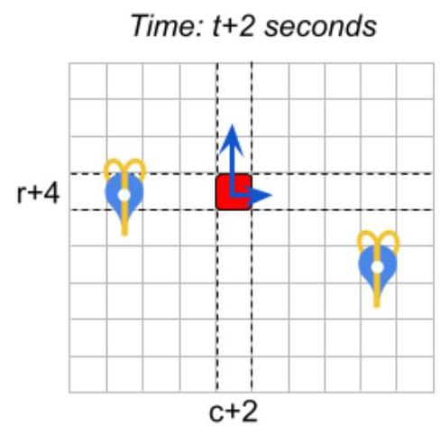
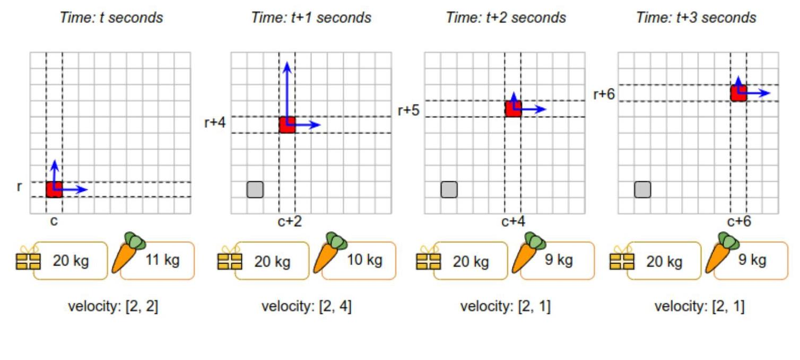
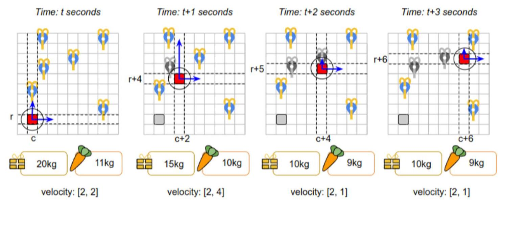

## World Finals - Hash Code 2022

## Santa Tracker

## Introduction

Every year since 2004, the Google Santa Tracker project has helped visualize the route taken by the legendary character Santa Claus each December to distribute gifts to kids around the world.

Though December is months away, preparations are in full swing at Santa's home in Lapland. The Google Santa Tracker is also getting ready, and rumors are that this year is going to be especially interesting. A secret team of Engineers in Light-speed Flights (ELF), in collaboration with the Gnome Institute of Generous Gift Logistics Engineering (GIGGLE) in Lapland, is working to develop new experimental optimization algorithms that help Santa deliver gifts more effectively.

The early results are promising, but Santa thinks they can be improved. When Santa learned about the famous optimization skills of Hash Code participants, he asked if Hash Code World Finalists would be able to help out. Are you up for the challenge?

## Task

Santa is delivering gifts on a frictionless 2D plane, using a reindeer-powered sleigh that accelerates using... carrots 2.

Your task is to plan actions for the sleigh to make gift deliveries and maximize the total score.

## Problem description

## The world

The world is a 2D grid with integer coordinates. We refer to a cell at column $c$ and row $r$ as(c, r) $\left( {-{10}^{9} \leq  c, r \leq  {10}^{9}}\right)$ .

The distance between two cells $\left( {{c}_{a},{r}_{a}}\right)$ and $\left( {{c}_{b},{r}_{b}}\right)$ is calculated as $\sqrt{{\left| {c}_{a} - {c}_{b}\right| }^{2} + {\left| {r}_{a} - {r}_{b}\right| }^{2}}$ (Euclidean distance).

Santa starts at Lapland(0,0)where all the gifts are stored.

Santa only has $T$ seconds to deliver the gifts, so hurry up!

## Gifts and carrots

There are two types of things Santa can load onto his sleigh: gifts and carrots.

Gifts need to be delivered to children around the world. You are given the list of $G$ gifts, for each of which you know:

- the name of the child that should receive it,

- the score awarded for delivering this gift,

- the weight of the gift in kilograms (kg),

- the coordinates(c, r)where it needs to be delivered.

Carrots are food for Santa's magic reindeer who need to eat them to accelerate. Each carrot weighs $1\mathrm{\;{kg}}$ (yes, we know they are heavy... but they really are magic!).

Thanks to a very effective team of helper gnomes, gift delivery happens instantaneously at the beginning of the second. Similarly, gift/carrots pick up happens instantaneously at the beginning of the second.

## Range

Santa can deliver gifts to all children within a maximum distance of $D$ (inclusive) from his sleigh. Similarly, Santa can pick up gifts and carrots whenever the sleigh is within a maximum distance of $D$ (inclusive) from his base at(0,0). We call this maximum distance of $D$ "range".

For example, for the range $D = 3$ and the sleigh at(c, r):

- The cell(c - 2, r - 2)is within the range from(c, r), because the Euclidean distance is $\sqrt{{\left| \left( c - 2\right)  - c\right| }^{2} + {\left| \left( r - 2\right)  - r\right| }^{2}} = \sqrt{8}$ and $\sqrt{8} \leq  3$ .

- The cell $\left( {c + 1, r + 3}\right)$ (marked in black in the figure below) is not within the range from (c, r), because the Euclidean distance is $\sqrt{{\left| \left( c + 1\right)  - c\right| }^{2} + {\left| \left( r + 3\right)  - r\right| }^{2}} = \sqrt{10}$ and $\sqrt{10} > 3$ .

## Navigation

Santa moves around the world on his magic sleigh.

Thanks to the magic coating on his sleigh, Santa encounters no friction and conserves speed indefinitely. At any point the movement of the sleigh can be described as its velocity $\left\lbrack  {{s}_{c},{s}_{r}}\right\rbrack$ , denoting how fast the sleigh moves in each direction within one second.

Santa starts with the velocity of $\left\lbrack  {0,0}\right\rbrack$ (not moving).

For example, in the figure below the sleigh is initially at position(c, r)and its velocity is $\left\lbrack  {1,2}\right\rbrack$ .

As long as the velocity remains constant, after each second the sleigh will move 1 position to the right and 2 positions upwards.

Time: $t$ seconds Time: t+1 seconds

## Maneuvering

Each second, Santa can choose to feed one carrot (previously loaded to the sleigh) to the reindeer to accelerate by a chosen value in one of four directions: up, down, left, right. "Acceleration" means changing the velocity. If the velocity is initially $\left\lbrack  {{s}_{c},{s}_{r}}\right\rbrack$ and Santa accelerates, then:

- "accelerating up" by $a$ means changing the velocity to $\left\lbrack  {{s}_{c},{s}_{r} + a}\right\rbrack$

- "accelerating down" by $a$ means changing the velocity to $\left\lbrack  {{s}_{c},{s}_{r} - a}\right\rbrack$

- "accelerating right" by $a$ means changing the velocity to $\left\lbrack  {{s}_{c} + a,{s}_{r}}\right\rbrack$

- "accelerating left" by $a$ means changing the velocity to $\left\lbrack  {{s}_{c} - a,{s}_{r}}\right\rbrack$

Note that the concept of "acceleration" (defined above) allows Santa to "decelerate" (slow down) as well. For example, if accelerating up by 2 makes Santa's sleigh go faster, then a subsequent "acceleration" down by 2 will make them go slower.

Santa can choose to accelerate, but even magic sleighs have their limitations! The maximum acceleration that Santa's reindeers can provide at a given moment depends on the current weight of the sleigh. The heavier the sleigh, the slower the maximum acceleration!

The weight of the sleigh is a sum of:

- the weight of the gifts loaded on the sleigh

- the weight of the carrots loaded on the sleigh

Each input data set specifies the maximum acceleration in given ranges of sleigh weights. Maximum acceleration of ${a}_{i}$ for sleigh weight range $\left( {{l}_{i - 1},{l}_{i}}\right\rbrack$ means that the maximum acceleration is equal to ${a}_{i}$ (inclusive) for all sleigh weights of $w$ that meet the constraints of ${l}_{i - 1} < w \leq  {l}_{i}.$

This sleigh weight above includes the carrot just about to be eaten by the reindeer. However, right after the acceleration, the carrot is eaten and converted into reindeer energy, instantenously reducing the weight of the sleigh by $1\mathrm{\;{kg}}$ .

If reindeer can’t handle the weight of the sleigh $\left( w\right.$ is above maximum $\left. {l}_{i}\right)$ they can’t accelerate at all (max acceleration $= 0$ ). The sleigh keeps its speed and continues floating until acceleration becomes possible again (e.g. gifts are delivered) or the time runs out. Also if there are no carrots on the sleigh, acceleration is not possible!

The acceleration is instantaneous and happens in the beginning of the second. Santa's sleigh can only accelerate once per second (it must float for at least one second before another acceleration is possible).

Consider the example represented in the description and the figure below.

The acceleration ranges are as follows, for the sleigh weight denoted as $w$ :

- if $0 < w \leq  {30kg}$ , the sleigh can accelerate by up to 4

- if ${30}\mathrm{\;{kg}} < w \leq  {500}\mathrm{\;{kg}}$ , the sleigh can accelerate by up to 2

- if the weight is higher than ${500}\mathrm{\;{kg}}$ the sleigh can’t accelerate at all

The initial weight of the sleigh consists of ${20}\mathrm{\;{kg}}$ of presents and ${11}\mathrm{\;{kg}}$ of carrots. So the total weight is ${31}\mathrm{\;{kg}}$ which means the maximum acceleration is 2 . The initial velocity at $t$ seconds is $\left\lbrack  {2,2}\right\rbrack$ .

- At $t$ seconds: the sleigh is at(c, r). The sleigh accelerates up by 2 (which is the maximum allowed acceleration for the sleigh weight of ${31}\mathrm{\;{kg}}$ ). Since acceleration occurs instantaneously at the beginning of the second, the new velocity at the beginning of $t$ seconds is $\left\lbrack  {2,4}\right\rbrack$ . The weight of the sleigh becomes ${30}\mathrm{\;{kg}}$ because one carrot is used. Then the sleigh floats for 1 second.

- At $t + 1$ seconds: the sleigh is at $\left( {c + 2, r + 4}\right)$ . The sleigh accelerates down by 3 (which is now allowed since in the previous second the weight decreased to ${30}\mathrm{\;{kg}}$ , increasing the maximum acceleration to4). The new velocity at the beginning of $t + 1$ seconds is $\left\lbrack  {2,1}\right\rbrack$ . Then the sleigh floats for 1 second.

- At $t + 2$ seconds: the sleigh is at $\left( {c + 4, r + 5}\right)$ . The sleigh doesn’t accelerate (the velocity remains at $\left\lbrack  {2,1}\right\rbrack  )$ and just floats for another second.

- At $t + 3$ seconds: the sleigh is at $\left( {c + 6, r + 6}\right)$

Note that the weight of the sleigh is also updated when gifts are delivered to children.

Consider the example below. The sleigh movement is the same as in the figure above, but we add gift deliveries. The range is $D = 1$ .

- At $t + 1$ seconds: the sleigh is at $\left( {c + 2, r + 4}\right)$ . We deliver a gift to cell $\left( {c + 1, r + 4}\right)$ , reducing the weight of the sleigh by $5\mathrm{\;{kg}}$ .

- At $t + 2$ seconds: the sleigh is at $\left( {c + 4, r + 5}\right)$ . We deliver a gift to cell $\left( {c + 4, r + 5}\right)$ (the same cell in which the sleigh is located), reducing the weight of the sleigh by another $5\mathrm{\;{kg}}$ .

Observe that, even though between $t$ and $t + 1$ the sleigh passes close to the gift delivery location at $\left( {c, r + 2}\right)$ , it is not possible to deliver it. This is because gift deliveries must happen at the beginning of a second, not while the sleigh is floating.

## Actions

The sleigh can perform the following actions. All actions apart from "Float" are instantaneous (take 0 seconds). All actions can be performed regardless of whether the sleigh is moving (no need to stop to make deliveries or load the sleigh).

- Accelerate in one of four directions (up, down, left or right) by a given acceleration (not more than the maximum acceleration for the current weight of the sleigh). The sleigh has to take the float action at least once between two consecutive accelerations.

- Float for a number of seconds. The velocity of the sleigh remains constant during the float action.

- Load a number of carrots. The sleigh needs to be within a distance $D$ from the initial position(0,0).

- Load a given gift. The sleigh needs to be within a distance $D$ from the initial position(0,0).

- Deliver a given gift. The delivery location of the given gift has to be within a distance $D$ from the sleigh's position.

For instance, the following 3 sequences of actions are valid:

1. Accelerate up $\rightarrow$ Float $\rightarrow$ Accelerate down $\rightarrow$ Float

2. Accelerate up $\rightarrow$ Give Gift $\rightarrow$ Float $\rightarrow$ Load Carrots $\rightarrow$ Float $\rightarrow$ Accelerate left $\rightarrow$ Float

3. Float $\rightarrow$ Accelerate up

Observe that in (3) the last "Accelerate up" action is not affecting the final position of the sleigh: the velocity is updated, but the sleigh doesn't move at the updated velocity until a "Float" command is issued.

The following 2 sequences of actions are invalid because there are two acceleration actions without any float action between them:

- Accelerate left $\rightarrow$ Accelerate down $\rightarrow$ Float

CFloat $\rightarrow$ Accelerate up $\rightarrow$ Load Carrots $\rightarrow$ Accelerate down

## Input data sets

## File format

Each input data set is provided in a plain text file. The file contains only ASCII characters with lines ending with a single "\\n' character (also called "UNIX-style" line endings). When multiple strings and numbers are given in one line, they are separated by a single space between each two elements.

The first line of the input file contains:

- $T$ - the time limit in seconds, $\left( {1 \leq  T \leq  {10},{000}}\right)$

- $D$ - the reach range $\left( {0 \leq  D \leq  {100}}\right)$ , that is maximum distance from sleigh for gift delivery and gift/carrot pick up

- $W$ - the number of acceleration ranges sleigh has $\left( {1 \leq  W \leq  {10}}\right)$ .

- $G$ - the number of gifts in the dataset, $\left( {1 \leq  G \leq  {10},{000}}\right)$

The subsequent $W$ lines contain the acceleration ranges description - two integer numbers separated by a single space:

- ${l}_{i}$ - an integer number, the maximum weight of the sleigh to use the following acceleration ( $\left. {1 \leq  {l}_{i} \leq  {10}^{6}}\right)$ .

- ${a}_{i}$ - an integer number, the max acceleration for this acceleration range $\left( {1 \leq  {a}_{i} \leq  {100}}\right)$

Note that the weight range of the sleigh for max acceleration ${a}_{i}$ is $\left\lbrack  {{l}_{i - 1},{l}_{i}}\right\rbrack$ where ${l}_{0} = 0$ . It is guaranteed that ${l}_{i - 1} < {l}_{i}$ and ${a}_{i - 1} > {a}_{i}$

The subsequent $G$ lines contain gift descriptions - strings and integer numbers separated by single spaces:

- name ${e}_{i}$ - the name of the child (a unique string of a-z, A-Z,0-9 characters up to 30 characters long)

- ${s}_{i}$ - an integer number, the score for delivering the gift $\left( {1 \leq  {s}_{i} \leq  {10},{000}}\right)$

- ${w}_{i}$ - an integer number, the weight of the gift in kilograms $\left( {1 \leq  {w}_{i} \leq  1,{000}}\right)$

- ${c}_{i}$ - the column of the location of the child $\left( {-{10}^{9} \leq  {c}_{i} \leq  {10}^{9}}\right)$

- ${r}_{i}$ - the row of the location of the child $\left( {-{10}^{9} \leq  {r}_{i} \leq  {10}^{9}}\right)$

Every position $\left( {{c}_{i},{r}_{i}}\right)$ in the datasets is guaranteed to have at most 1 gift recipient and Lapland at(0,0)is guaranteed to have none.

## Example

---

	<table><tr><td>Input file</td><td>Description</td></tr><tr><td>15 3 4 4</td><td>15 seconds, delivery distance of 3,4 acceleration</td></tr><tr><td>15 8</td><td>For weights from 0 to 15, max acceleration is 8</td></tr><tr><td>30 6</td><td>For weights from 16 to 30, max acceleration is 6</td></tr><tr><td>45 4</td><td>For weights from 31 to 45, max acceleration is 4</td></tr><tr><td>60 2</td><td>For weights from 46 to 60, max acceleration is 2</td></tr><tr><td colspan="2">(For weights bigger than ${60}\mathrm{\;{kg}}$ , max acceleration i</td></tr><tr><td>Olivia 1 10 5 1</td><td>Gift for Olivia, score 1, 10 kg, at (5, 1)</td></tr><tr><td>Emma 2 10 -10 1</td><td>Gift for Emma, score 2, 10 kg, at (-10, 1)</td></tr><tr><td>Liam 5 10 8 4</td><td>Gift for Liam, score 5, 10 kg, at (8, 4)</td></tr><tr><td>Bob 10 15 0 -100</td><td>Gift for Bob, score 10, 15 kg, at (0, -100)</td></tr></table>

---

Note that the input file does not contain any blank lines. Blank lines and line wrapping in the example above are added for clarity.

## Submissions

You need to specify the actions for Santa.

## File Format

The submission file must be a plain text file containing exclusively ASCII character lines terminated with a single '\\n' character ("UNIX-style" line endings).

The first line must contain a single integer $C\left( {0 \leq  C \leq  {10}^{6}}\right)$ : the number of actions for Santa.

Each of the following lines must contain a valid action for the sleigh. Each action description must contain the action name and the action argument, separated by a space. The possible actions are:

- AccUp (a) - Accelerates in the "up" direction by integer $a\left( {0 \leq  a \leq  {a}_{i}}\right.$ , where ${a}_{i}$ is the applicable maximum acceleration for the current weight of the sleigh)

- AccDown (a) - Accelerates in the "down" direction by integer $a\left( {0 \leq  a \leq  {a}_{i}}\right.$ , where ${a}_{i}$ is the applicable maximum acceleration for the current weight of the sleigh)

- AccLeft (a) - Accelerates in the "left" direction by integer $a\left( {0 \leq  a \leq  {a}_{i}}\right.$ , where ${a}_{i}$ is the applicable maximum acceleration for the current weight of the sleighh)

- AccRight (a) - Accelerates in the "right" direction by integer $a\left( {0 \leq  a \leq  {a}_{i}}\right.$ , where ${a}_{i}$ is the applicable maximum acceleration for the current weight of the sleigh)

- Float $\langle t\rangle$ - Advances the time by integer $t$ seconds $\left( {1 \leq  t \leq  T}\right)$ . In each second the position of the sleigh advances by the current velocity.

- LoadCarrots $\langle \mathrm{N}\rangle$ - Loads integer $\mathrm{N}$ carrots onto the sleigh $\left( {1 \leq  N \leq  1,{000},{000}}\right)$ , only valid within a distance $D$ inclusive from(0,0).

- LoadGift (ChildName) - Loads a gift for the given child, only valid within a distance $D$ inclusive from(0,0).

- DeliverGift (ChildName) - Delivers the gift for the given child, only valid within a distance $D$ inclusive from the child.

## Example

<table><tr><td>Submission file</td><td>Description</td></tr><tr><td>23</td><td>The file describes 23 actions</td></tr><tr><td>LoadCarrots 10</td><td>Load 10 carrots, increasing the weight to 10 kg</td></tr><tr><td>LoadGift Olivia</td><td>Load Olivia's gift, increasing the weight to 20</td></tr><tr><td>LoadGift Liam</td><td>Load Liam's gift, increasing the weight to ${30}\mathrm{\;{kg}}$</td></tr><tr><td>AccRight 4</td><td>Accelerate, changing velocity to $\left\lbrack  {4,0}\right\rbrack$ and weigh</td></tr><tr><td>Float 1</td><td>Let 1 second pass. Santa moves to(4,0)</td></tr><tr><td>DeliverGift Olivia</td><td>Deliver Gift to Olivia, reducing weight to ${19}\mathrm{\;{kg}}$</td></tr><tr><td>AccUp 2</td><td>Accelerate, changing velocity to $\left\lbrack  {4,2}\right\rbrack$ and weigh</td></tr><tr><td>Float 1</td><td>Let 1 second pass. Santa moves(8,2)</td></tr><tr><td>DeliverGift Liam</td><td>Deliver Gift to Liam, reducting weight to 8 kg.</td></tr><tr><td>AccLeft 8</td><td>Accelerate, changing velocity to $\left\lbrack  {-4,2}\right\rbrack$ and weig</td></tr><tr><td>Float 1</td><td>Let 1 second pass. Santa moves to(4,4)</td></tr></table>

---

	<table><tr><td>AccDown 4 Float 1Let 1 second pass. Santa moves to(0, - 22)</td><td>Accelerate, changing velocity to $\left\lbrack  {-4, - 2}\right\rbrack$ and wei</td></tr><tr><td>Float 1</td><td>Let 1 second pass. Santa moves to(0,2)</td></tr><tr><td>LoadGift Bob</td><td>Load Bob's gift, increasing the weight to ${21}\mathrm{\;{kg}}$ .</td></tr><tr><td>AccRight 4</td><td>Accelerate, changing velocity to $\left\lbrack  {0, - 2}\right\rbrack$ and weig</td></tr><tr><td>Float 1</td><td>Let1second pass. Santa moves to(0,0)</td></tr><tr><td>AccDown 6 Float 1 AccDown 6</td><td>Accelerate, changing velocity to $\left\lbrack  {0, - 8}\right\rbrack$ and weig Let 1 second pass. Santa moves to(0, - 8) Accelerate, changing velocity to $\left\lbrack  {0, - {14}}\right\rbrack$ and wei</td></tr><tr><td>AccDown 6</td><td>Accelerate, changing velocity to $\left\lbrack  {0, - {20}}\right\rbrack$ and wei</td></tr><tr><td>Float 4</td><td>Let 4 seconds pass. Santa moves to(0, - 102)</td></tr><tr><td>DeliverGift Bob</td><td>Deliver Gift to Bob, reducing weight to 2 kg</td></tr></table>

---

Note that the submission file should not contain any blank lines. Blank lines and line wrapping in the example above are added for clarity.

## Validation

In order for the submission to be accepted, it must fulfill the following conditions:

! The submission file must have exactly $C + 1$ lines in the format described above.

1 Santa must not attempt loading gifts or carrots onto the sleigh when he’s further than $D$ from(0,0).

1 Santa must not attempt delivering a gift when he’s further than $D$ from the destination.

! Santa can only deliver each gift once, and only if it was loaded to the sleigh previously.

I Santa can only load each gift once. (After a gift is loaded, it is either delivered, or it stays on the sleigh until the end of the simulation.)

1 Santa must not attempt to accelerate more than what is permitted given the current weight of the sleigh.

1 Santa must not attempt to accelerate more than once in a second (without a Float action in between).

! Santa must not attempt the Float action after the time of simulation ran out.

## Scoring

The score of your solution is the sum of the scores awarded for each gift that have been delivered.

For example, the sample solution scores 16 points: 1 for Olivia's gift, 5 for Liam's gift, and 10 for Bob's gift.

Note that there are multiple data sets representing separate instances of the problem. The final score for your team will be the sum of your best scores on the individual data sets.